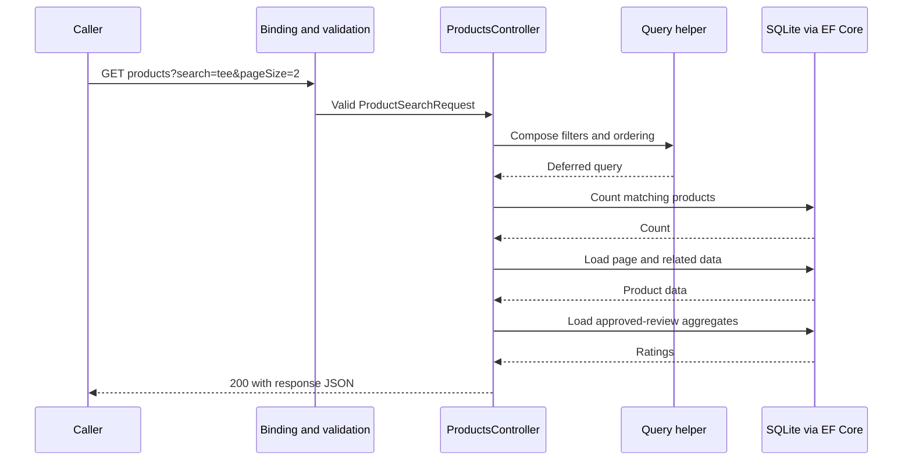

# 04: One browsing request, told as a story

[Home](README.md) · Previous: [Folder map](03-find-your-way.md) · Next: [Read code slowly](05-read-code-slowly.md)

**Small outcome:** trace one read from URL to response.

Our shopper asks:

```http
GET /api/products?search=tee&pageSize=2
```

## The story

**1. The request arrives.** The application is already running. Its configured HTTP pipeline routes this GET to `ProductsController.List`.

**2. Text becomes typed input.** The framework binds `search=tee` and `pageSize=2` into a `ProductSearchRequest`. The page defaults to 1. Model validation checks the input; `pageSize=101` would be rejected before the action body executes.

**3. The controller describes a search.** It starts from `db.Products.AsNoTracking()` and calls `ProductCatalogQuery.Apply`. The helper adds the requested filters and ordering. At this point it is composing an `IQueryable`, a description of database work.

**4. The controller asks for a count.** `CountAsync` executes database work to count matching products. It counts all matches, not just this page.

**5. The controller asks for this page.** `Skip`, `Take`, and the `Include` calls describe which products and related data to load. `ToListAsync` executes that query and creates C# objects from the results.

**6. Ratings are loaded and a response is made.** `LoadRatings` obtains approved-review aggregates for the returned product IDs. Mapping creates product response DTOs. `Ok(...)` returns a successful HTTP result; the framework serializes its data as JSON.

## The same story as arrows



If your Markdown viewer cannot render the diagram, read the numbered story; it conveys the same steps.

## The same story as a sorting exercise

Put these in order: **return JSON**, **validate request**, **compose query**, **load page**.

Now add **count matches** in the position used by this implementation. Check your order against steps 2–6.

## What did not happen?

This request did not reserve stock, charge a payment, or create an order. Filtering by `inStock=true` observes current availability. It does not promise those units will still be available at checkout.

**Q4:** If five products match and `pageSize=2`, what are the first page's item count and total count?

**Q5:** Does the query helper itself fetch products by calling `ToListAsync`?

**Stop:** tell the story in four sentences without using the term `IQueryable`. Then reread step 3 and add that term back in. [Answers](14-answer-key.md).
