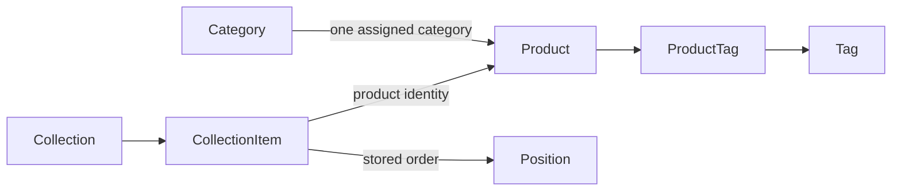

# Module 4, second workshop: tags are sets; collections have order

[Bootcamp home](README.md) | [Tracker](story-tracker.md) | [Journal](journal.md)

Stories: MS-01 and MS-02. This workshop describes the implementation under development. Check the tracker for migration and test evidence before treating it as complete.

## Two ways to organize the same products

A category is a product's assigned shelf. A tag is a reusable label that can cross shelves. A collection is an editor's ordered selection. One desk lamp can belong to the lighting category, carry the `summer` and `small-space` tags, and appear third in a starter-workspace collection.

| Question | Tag membership | Collection membership |
| --- | --- | --- |
| Does order carry meaning? | No; responses sort by slug for predictability | Yes; stored Position expresses the editor's choice |
| What is unique? | One product/tag pair | One collection/product pair |
| Which parent carries the revision? | Product.TagVersion | ProductCollection.Version |
| Can an empty replacement be meaningful? | Yes; it clears all tags | Yes; it creates an empty editorial selection |
| What happens when a product is deleted? | Its tag links disappear; reusable tags remain | Its collection links disappear; affected collections advance their revisions |

Read [the organization entities](../../src/Agora.Domain/Entities/CatalogOrganization.cs) and [Product.ReplaceTags](../../src/Agora.Domain/Entities/Product.cs). These relationships use join rows. A join row says “these two records are related”; a collection join also stores where the product belongs in the sequence.

Read each path aloud. A product/tag link has no position; a collection/product link does. The different child fields follow from the different user needs.

## Follow a tag from creation to search

An admin sends POST `/api/admin/tags` with `{"name":" Summer ","slug":" SUMMER "}`. The domain normalizes the display name to `Summer` and the slug to `summer`. The slug accepts only lowercase ASCII letter/digit segments joined by single hyphens, at most 60 characters. It becomes immutable identity; this feature does not expose rename or delete operations.

The domain's [CatalogText helper](../../src/Agora.Domain/Common/CatalogText.cs) owns those authoring rules. A pre-save uniqueness check gives a clear conflict early. A unique database index still protects the race where two creators both observe that the slug is available. Normalization happens before both checks so ` SUMMER ` cannot evade an existing `summer` slug.

Next, PUT `/api/admin/products/{id}/tags` supplies `tagIds` and `expectedVersion`. The server loads the product and current tag links, checks the revision, and resolves every requested tag. One unknown ID rejects the whole request before any membership changes. An empty array clears the set.

Work this replacement by hand: existing tags are A and B; requested tags are B and C. Remove A, retain B's row, add C. Retaining the intersection avoids deleting and recreating unchanged rows. The product revision advances and the whole set replacement saves atomically. A stale conditional update must roll back its child-row changes.

Finally, GET `/api/products?tagSlug=summer` applies a relationship `Any` predicate before count and page selection. Products in different categories can match. Adding a category filter intersects the two conditions. An unknown but valid slug produces a normal empty page, not a missing-resource error.

## Revisit an earlier lesson with a new relationship

Suppose the first page contains ten untagged products and the eleventh product carries `summer`. Loading the first ten and then filtering their tags returns an empty page and hides the real match. Filtering in SQL first lets the matching product enter the page. This is the same count-and-page rule from module 2, now applied through a many-to-many relationship.

Filtering by one tag does not mean returning only that tag. Product responses retain all assigned tags, sorted by slug, plus `tagVersion`. This resembles the earlier variant rule: a filter decides which products qualify; the response describes their complete choices or labels according to its contract.

Open [ProductReadQueries](../../src/Agora.Api/Queries/ProductReadQueries.cs). Products and collections share the response-data includes and approved-review aggregation. Tags are batch-loaded with the page, not queried in a loop. Split queries avoid multiplying image, variant, and tag rows into every possible combination. There are still several database round trips; this is not a transactionally frozen catalog snapshot.

### A real failed implementation to learn from

The first collection implementation ordered its membership rows, selected each row's Product navigation, then applied the shared includes. It compiled successfully but the public read returned HTTP 500. The test log showed EF rejecting Include after Select projected a different entity through a navigation. C# type checking had succeeded; provider translation had not.

The corrected read selects the bounded ordered product IDs first. It then loads response data from `db.Products`, whose query root supports those includes, builds an ID dictionary, and restores the selected order. This repeats module 4's comparison technique for a new reason: membership order lives outside the product table. If a product disappears or becomes inactive between reads, the mapper omits it instead of indexing a missing dictionary entry. Count and page reads are still separate observations under concurrent changes, as with ordinary offset paging.

The integration test protects the actual public result, including reordering and inactive-member pagination. It does not merely assert that a LINQ expression compiles. The journal records the failed run and the subsequent verification separately.

## Follow a collection through its lifecycle

1. Admin POST `/api/admin/collections` creates an empty unpublished collection with revision zero. Public readers receive 404 for it.
2. Admin GET `/api/admin/collections/{id}` returns its complete product-ID sequence, including inactive members. An editor needs the whole stored list to round-trip it safely.
3. Admin PUT replaces title, publication flag, and the complete ordered ID list using `expectedVersion`. Duplicates or missing products produce 422 without changing the old collection.
4. Public GET `/api/collections/{slug}` returns a published collection and a paged `products` result. The member query filters inactive products before counting and paging.
5. Unpublishing preserves the stored sequence. Deleting a product removes its membership and advances the affected collection revision so an old editor cannot unknowingly restore an obsolete view.

Use `[A,B,C]` as your first stored order. Replace it with `[C,A,B]`: positions become C=0, A=1, B=2. If A becomes inactive, public output is `[C,B]` with total count two. Admin output still contains `[C,A,B]`. The different outputs are intentional: public visibility and stored membership are separate facts.

## Why positions are not a unique index

Imagine swapping position zero and position one while a unique `(CollectionId, Position)` index checks each intermediate row update. The first update can collide with a position the second row has not vacated yet. This implementation gives membership pairs a unique key but keeps the position index nonunique. The domain replacement assigns the final positions, and a parent revision prevents competing replacements from silently winning.

The absence of a unique position constraint is a design choice, not permission for arbitrary writers to skip the domain rule. Public reads still use product ID as a tie-breaker, making legacy or unexpected ties deterministic. Domain replacement writes a complete zero-based sequence.

## Read the failure evidence

[CatalogOrganizationApiTests](../../tests/Agora.Tests/Integration/CatalogOrganizationApiTests.cs) uses real requests to cover normalization, cross-category tag search, complete response tags, unknown/stale replacements, admin restrictions, public drafts, reordering, inactive-member paging, and product cascades.

[CatalogOrganizationPersistenceTests](../../tests/Agora.Tests/Integration/CatalogOrganizationPersistenceTests.cs) goes below HTTP. Separate connections read the same revisions and then save competing changes in a controlled order. Fresh contexts inspect the winning rows after a losing save. Its migration test upgrades a preceding-schema fixture and checks that old products retain their identity and start with no tags and revision zero. These tests must actually run; their source alone is not completion evidence.

Read [the generated catalog migration](../../src/Agora.Infrastructure/Migrations/20260908192722_CatalogOrganization.cs). It adds the product revision and four organization tables. Find the unique slug indexes, composite membership keys, restricted tag deletion, product cascades, and nonunique position index; connect each to one rule from this workshop.

## Practice without looking at the implementation

Predict each result, then trace the relevant action:

- Tag assignment replaces `[A,B]` with `[B,C]`. Which row can remain unchanged?
- Search matches `summer`. Should a matching product's unrelated `small-space` tag disappear from its response?
- A collection's first two stored members are inactive and the third is active. What does public page one with size one contain?
- A customer has the correct admin collection URL and version. Can they replace it?
- Two editors load revision one and swap the same list differently. What must the losing save leave behind?
- A product is deactivated but not deleted. Should admin collection membership lose it?

Answers and reasoning

The B tag link can remain; only A is removed and C added. A matching product still exposes all its tags. Filtering active members first means the third stored member becomes the first public result. Correct IDs and revisions do not grant the Admin role, so the customer is forbidden. A losing replacement leaves the winning title, publication state, order, and revision intact. Deactivation changes public visibility but preserves admin membership.

Explain the design once as shelves, labels, and a playlist. Explain it again as foreign keys, join rows, ordering, and concurrency tokens. Then show the exact query predicate and save boundary for one request. Moving between those descriptions is the learning objective.
