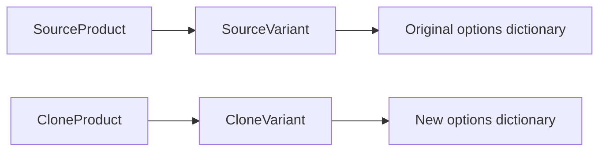

# Module 4, third workshop: clone a product without copying its history

[Bootcamp home](README.md) | [Tracker](story-tracker.md) | [Journal](journal.md)

Story: MS-06. Check the tracker for the current build and acceptance results. Draft cloning introduces an endpoint and a pure object-graph builder; it does not require another migration.

## Start with a concrete distinction

A recipe can be copied. The meals already sold from that recipe belong to the original business events. Product cloning follows that distinction: reusable catalog values are copied into a new product, while stock and operational history start fresh.

Suppose the original product has two variants, fifteen units on hand for each, two reserved units for each, one approved review, a tag, a collection membership, and a cart line. The clone is a different product with new variant and image IDs. It begins inactive, with zero units on hand and reserved, no reviews, no tags, no collection membership, and no cart lines.

The client must supply a new product name, a new slug, and one new SKU for each source variant. That makes the new commercial identity explicit. The server copies the existing variant names, prices, currencies, weights, and options.

## Classify each field before writing code

| Source information | Clone behavior | Reason |
| --- | --- | --- |
| Product, variant, image IDs | New IDs | These are new database rows |
| Product name and slug | Supplied by caller | The new product needs its own identity |
| Variant SKU | Supplied through exact source-ID mapping | Each new variant needs a unique SKU |
| Description, category, tax category | Copied values/references | Reusable catalog classification |
| Variant name, price, currency, weight | Copied values | Reusable commercial description |
| Options dictionary | New dictionary with the same entries | Mutable objects must not be shared accidentally |
| Image URL, alt text, sort order | Copied into new image rows | Reuse the link and presentation, not row identity |
| Active flag | Always false | Activation is a later explicit edit |
| Inventory on-hand/reserved | Both zero | Existing stock belongs to the source variant |
| Reviews, cart/order history, tags, collections | Not copied | The clone starts without those relationships |

This table is a useful technique before any “duplicate” feature. Copying everything first and then clearing fields makes omissions easy to miss. Explicit construction lets a reviewer inspect exactly which values cross the boundary.

## Trace the request

Open [ProductCloningController](../../src/Agora.Api/Controllers/ProductCloningController.cs), [its request contracts](../../src/Agora.Api/Contracts/ProductCloningContracts.cs), and [ProductDraftCloner](../../src/Agora.Domain/Services/ProductDraftCloner.cs).

1. The route requires the Admin role. Knowing a source ID is insufficient.
2. The controller reads the source with variants and images in one SQL query. It reads at most 51 variants: the 51st is a sentinel proving the permitted limit of 50 was exceeded. It returns 422 rather than cloning a partial source.
3. It compares source variant IDs with mapping IDs. A missing, extra, or repeated mapping rejects the request. Matching counts alone would be insufficient: `[A,B]` and `[A,C]` both contain two entries.
4. Shared ProductInputRules trims SKUs and detects case-insensitive duplicates within the request, matching ordinary creation. Existing slug and stored-SKU collisions are checked before constructing the tracked clone graph.
5. The pure cloner creates the new Product, ProductVariant, ProductImage, InventoryItem, and option dictionaries. It has no DbContext and performs no network calls.
6. The controller adds the completed graph and saves once. Database uniqueness resolves a final race; a recognized unique-index conflict returns 409.
7. A successful response is 201 with the new product ID, slug, and inactive flag. Read the new product through the existing detail route. Activate it later through the normal product edit endpoint when ready.

An inactive source may be cloned. A source with zero variants is also supported for existing data that permits it, using an empty mapping list. Ordinary product creation still requires at least one variant. These are explicit endpoint contracts, not assumptions that every stored row came through today's create endpoint.

## Why a new dictionary matters

Consider this incorrect in-memory assignment:

```csharp
cloneVariant.Options = sourceVariant.Options;
```

There is one dictionary with two references pointing to it. Updating `cloneVariant.Options["Size"]` also changes the dictionary observed through `sourceVariant.Options`.

The implementation instead constructs a dictionary:

```csharp
Options = new Dictionary<string, string>(original.Options)
```

Now the two dictionaries have equal entries but separate identities. Strings themselves are immutable, so copying those entries is sufficient for this dictionary's value type. A dictionary of mutable nested objects would need a different copying decision.

Image identity interacts with ordering too. Public galleries sort by SortOrder and then ID. Two source images can share a sort position; assigning arbitrary new IDs could reverse their visible order even while copying both SortOrder values correctly. The cloner orders the source images as the public mapper does, generates and sorts new image IDs, and assigns those IDs in that sequence. This preserves both the stored sort values and visible tie order while every image still receives a new identity. A dedicated test covers tied positions.



Read the diagram once as objects in memory and once as rows after persistence. The dictionaries are object values stored through the existing options conversion; product and variant IDs establish database identity. Those are related but different forms of identity.

## Two tests catch different mistakes

[ProductDraftClonerTests](../../tests/Agora.Tests/Unit/ProductDraftClonerTests.cs) changes the clone's dictionary and image and clears its variant list before persistence. It checks that the source objects remain unchanged. A database round-trip might create separate objects automatically and hide an in-memory aliasing bug, which is why this small pure test is useful.

[ProductCloningApiTests](../../tests/Agora.Tests/Integration/ProductCloningApiTests.cs) checks real persistence: copied fields, new IDs, zero stock, no inherited memberships, source preservation, exact mappings, source limits, and access control. Its source includes reserved inventory and an approved review, so resetting these values is tested against nonempty source state.

The unique-SKU rollback test prepares two complete draft graphs using one supposedly free SKU. The first save wins. The second reaches the database constraint and fails. A fresh context checks that the losing product, variants, images, and inventory rows do not survive. This proves more than an early API collision check: the transaction also protects a conflict discovered during persistence.

## A reproducible request shape

Read a real source through GET `/api/products/{id}` and copy its variant IDs. For a source with two variants, send:

```json
{
  "name": "New draft product",
  "slug": "new-draft-product",
  "variantSkus": [
    { "sourceVariantId": "<first-source-variant-guid>", "sku": "NEW-CHOICE-A" },
    { "sourceVariantId": "<second-source-variant-guid>", "sku": "NEW-CHOICE-B" }
  ]
}
```

Replace the placeholder GUIDs and choose unused identity values. POST it to `/api/admin/products/{sourceId}/clone` with an admin bearer token. The placeholders above are explanatory and are not valid GUID inputs themselves. Follow [getting started](../../docs/getting-started.md) for running the API and obtaining local credentials.

Then read the new product and inventory, compare them with the source, and attempt the same new SKU on another clone. Predict the 409 and unchanged row counts before trying it. Use a disposable local dataset for exercises that intentionally create products.

## Practice questions

1. Why is a new product ID insufficient if variant IDs are reused?
2. Why must exact mapping validation compare sets as well as counts?
3. Why must the database retain unique indexes after the API checks availability?
4. Why does one save matter when the clone contains several entity types?
5. Why is copying an image URL different from copying an image row's ID?
6. Why might an API integration test miss an object-aliasing bug?

<details>
<summary>Answers and reasoning</summary>

Reused variant IDs would still identify old rows and could connect the clone to old stock or history. Equal counts do not prove the same identities were supplied. Another request can take a free SKU between the API check and save, so the index is the final authority. One transactional save makes the graph succeed or roll back together. A URL is a reusable value; an image ID identifies one row under one parent. Database materialization can construct separate object instances, hiding a shared-reference mistake that existed before persistence.

</details>

Explain the feature in one plain sentence, then explain the same idea using object identity, foreign keys, and a transaction. Finally, point to the test that would fail if each reset or copy rule were removed. This turns “I understand cloning” into several concrete, checkable claims.
