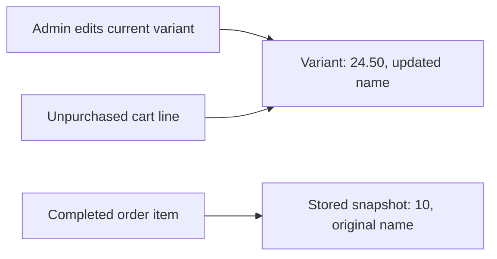

# Module 4, fourth workshop: edit live choices and ordered galleries

[Bootcamp home](README.md) | [Tracker](story-tracker.md) | [Journal](journal.md)

Stories: MS-04 and MS-05. The implementation is under verification; consult the tracker for migration and test results.

## Start with two promises

Changing a variant's current price should affect a cart that has not checked out yet. It should not rewrite the price recorded on an earlier purchase. Reordering a product's gallery should change its primary image predictably. It should not silently discard another editor's recently added image.

These promises require different data boundaries. A variant row holds live commercial values. An order item holds purchase-time snapshots. A gallery spans several image rows, but membership and order form one editable whole under the product's gallery revision.

Open [CatalogEditingController](../../src/Agora.Api/Controllers/CatalogEditingController.cs), [the editing contracts](../../src/Agora.Api/Contracts/CatalogEditingContracts.cs), [ProductVariant.Edit](../../src/Agora.Domain/Entities/ProductVariant.cs), and [the Product gallery methods](../../src/Agora.Domain/Entities/Product.cs).

## Trace one price edit through a cart and an order

Suppose variant V is named “Original choice” and costs 10 USD. A shopper purchases it. Another cart still contains V but has not checked out.

An administrator reads GET `/api/admin/products/{productId}/variants/{variantId}` and receives version zero. They PUT a replacement with name “Updated choice,” price 24.50, weight 750 grams, normalized options, and expectedVersion zero. The API checks both parent and variant IDs, compares the version, and invokes the domain edit.

The next live-cart read resolves the current variant and returns 24.50 and “Updated choice.” The earlier order item's stored UnitPrice remains 10 and its stored VariantName remains “Original choice.” Checkout made that historical copy when the order was created.



Read the arrows carefully. The cart needs a current choice. The order needs the facts of a past purchase. Joining every response to today's variant price would make old purchases appear to change when the catalog changes.

[CatalogEditingApiTests](../../tests/Agora.Tests/Integration/CatalogEditingApiTests.cs) exercises this through a real checkout, a second live cart, an admin edit, and a fresh database read of the purchased order. This is stronger evidence than constructing an OrderItem manually with a conveniently fixed value.

## Validate the complete replacement before assigning fields

The editable variant contract is deliberately narrow:

| Input | Rule |
| --- | --- |
| Name | 1–120 characters after trimming |
| Price amount | 0–1,000,000, at most two decimal places |
| Weight | Integer 0–1,000,000 grams |
| Options | At most 20 pairs; trimmed keys 1–60 and values 1–120; normalized keys distinct ignoring case |
| Expected version | Required nonnegative revision |

SKU, currency, and product identity are not replacement fields. Price construction retains the stored currency. The domain validates the name, amount, weight, and complete normalized options before assigning any of them. If the last option is invalid, an earlier name assignment must not have already changed the entity.

Price precision is checked before constructing Money. Otherwise Money's rounding could turn an invalid 1.001 input into an apparently acceptable 1.00 value. This repeats an important earlier lesson: validate information before a conversion discards it.

The new dictionary returned by VariantOptionRules also prevents the caller from mutating the entity indirectly after the edit method returns. A caller's input dictionary and the entity's stored options are separate objects.

## Another place where conversion can hide evidence

Consider raw JSON containing two properties both named `Size`. Ordinary dictionary deserialization can retain only the last value. By the time a domain method sees the dictionary, evidence of the duplicate has disappeared.

[VariantOptionsJsonConverter](../../src/Agora.Api/Contracts/VariantOptionsJsonConverter.cs) handles this particular input property. It rejects repeated raw keys while reading the JSON object. Domain normalization then rejects distinct raw keys such as `Size` and ` size ` that become duplicates after trimming and case-insensitive comparison.

These checks occur at different boundaries:

- JSON reader: preserve and validate the raw object shape before materialization loses evidence.
- Domain normalizer: validate the business meaning of the resulting keys and values.
- Database save: check that the version still matches the entity that was read.

An empty options object is valid and clears options. A missing options object is not a complete replacement. The API test sends repeated raw JSON keys explicitly; a normal Dictionary cannot represent two identical keys for that test.

## One gallery, several child rows

Start with image IDs A, B, C in that order. Add D, then reorder to C, A, D, B, then remove A. The final visible order should be C, D, B with positions zero, one, two.

Admin GET `/api/admin/products/{productId}/images` returns image IDs, sort positions, and the gallery version. Every write requires that version. POST adds a link; PUT `.../images/order` supplies the exact current ID permutation; DELETE `.../images/{imageId}?expectedVersion=...` removes a child and compacts positions.

An exact permutation contains every current ID once. A shorter list is not an implicit delete request. A repeated ID is not a request to show an image twice. Validate the full set before updating positions so a malformed reorder leaves the old gallery untouched.

Public product mapping already sorts by SortOrder and then image ID. The gallery methods assign positions consistently with that mapping. Removing the primary image causes the next ordered image to become primary. Reordering an empty gallery with an empty array is valid; it still returns the accepted write's new revision.

## The parent revision protects child changes

Two editors may load A, B, C at gallery version zero. Editor B adds D and saves version one. Editor A's old reorder of A, B, C must not silently erase or ignore that intervening membership change. The action compares expectedVersion, and EF checks the original ImageRevision again during persistence.

Updating three image positions and the product revision occurs in one SaveChanges transaction. If the parent check fails, child-position changes roll back. [CatalogEditingPersistenceTests](../../tests/Agora.Tests/Integration/CatalogEditingPersistenceTests.cs) arranges this race with separate SQLite connections and inspects the winning order through a fresh context.

Product also carries TagVersion. EF includes configured concurrency tokens for the product row when updating it, so simultaneous tag/gallery edits can conservatively conflict even when their inputs concern different fields. The revisions identify separate kinds of user edits, but storing both tokens on one row does not make every unrelated update independent. The explicit 409 is preferable to claiming an independence guarantee the persistence model does not provide.

## Limits and legacy data

Gallery additions accept absolute HTTP/HTTPS links of at most 2,000 characters and optional alt text of at most 500. The API stores the link; it does not fetch it. Ordinary new-product creation and gallery additions are limited to ten images.

Existing larger galleries remain readable, reorderable, and removable. They cannot accept another gallery image until reduced below ten. No migration deletes their data. Draft cloning preserves the explicit cloning contract by copying a legacy source's complete gallery, even if it is larger than ten; that clone is then subject to the same addition restriction. This integration decision is documented in the journal and tested.

Old variant names may also exceed the new editor's 120-character limit because the original create contract allowed longer names. The migration preserves them. Reading remains possible; a later replacement must meet the editing contract. Schema upgrade and user-input validation are different operations.

## Read the migration and the tests as one argument

The schema change needs zero-initialized Variant.Version and Product.ImageRevision columns. A column alone is insufficient: EF must configure it as a concurrency token, and each relevant edit path must advance it.

[The generated revision migration](../../src/Agora.Infrastructure/Migrations/20260908195106_VariantAndGalleryRevisions.cs) adds exactly those two columns with zero defaults. It does not rename variants, reorder galleries, or remove legacy images.

The upgrade test prepares an old-schema product with a 180-character variant name and gallery positions three and seven. After upgrading, the old name, IDs, values, and positions remain, and both new revisions are zero. A valid edit after the upgrade advances the variant revision. The concurrency tests then prove the conditional saves against actual persisted rows.

Run the focused tests from the root after the migration is generated:

```powershell
dotnet test tests/Agora.Tests/Agora.Tests.csproj --filter "FullyQualifiedName~CatalogEditing|FullyQualifiedName~ProductCloning|FullyQualifiedName~ProductsApiTests"
```

The command is an instruction for reproducing verification. Read the journal for observed results rather than assuming the command has already passed.

## Explain it back with new examples

Predict these before looking at the implementation:

1. An option fails normalization after the price passed validation. What values should remain on the entity?
2. An old order references the same variant ID whose current price changed. Which price belongs in the order response?
3. A reorder omits one image. Is that a valid way to delete it?
4. A gallery has eleven legacy images. Which operations remain available?
5. Two writes passed their early version comparisons. What still decides whether both may save?
6. A migration introduces version columns. Does that alone make stale edits fail?

<details>
<summary>Answers and reasoning</summary>

All original variant values should remain because assignment follows complete validation. The order uses its purchased price snapshot. Omitting an image makes the permutation invalid; deletion is a separate endpoint. The large gallery can be read, reordered, reduced, and copied through the documented legacy-clone rule, but cannot be extended until below ten. Database concurrency predicates decide the final save race. Version columns need token mapping and participating write methods; merely storing numbers does not enforce optimistic concurrency.

</details>

Finish by tracing one successful edit and one rejected edit through input, domain state, SQL condition, and response. Then explain why the earlier order stays unchanged without saying “because the test passes.” The test is evidence; the snapshot data model is the reason.
