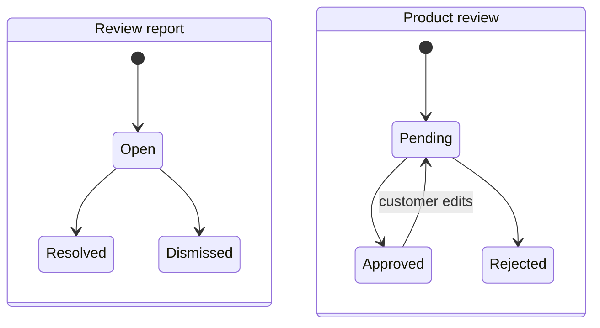

# Workshop 5e: a resolved report is not a removed review

Story: MS-18. Follow [the tracker](story-tracker.md) for evidence. This feature adds a customer report and an administrator resolution without silently changing the source review.

## Draw two state machines

The review diagram is a simplified teaching view of the existing moderation methods, not an exhaustive restriction on administrator transitions. The important observation is that resolving a report does not draw an automatic arrow on the review's state machine.

A report may be resolved because an administrator investigated it and decided no review change was needed. If moderation is required, the administrator uses the existing explicit review moderation endpoint separately.

## Follow the customer's request

[ReviewReportsController](../../src/Agora.Api/Controllers/ReviewReportsController.cs) takes the reporter ID from authentication. It accepts named reasons Spam, Abuse, or OffTopic and an optional plain-text comment up to 500 characters. Numeric enum values and combined names are rejected.

The referenced review must exist, currently be approved, and belong to someone else. One customer can report a particular review once. A database unique index protects that rule when requests overlap; repeat submission returns 409 rather than creating a second report.

Creation reads the review and inserts the report inside one local transaction. The customer receives a small receipt containing their submission and its initial state, not reporter identities, administrator notes, or another customer's report list.

Repeat the rule aloud: “I can submit my concern about an approved review; that submission does not itself moderate the review.”

## The administrator queue is a separate projection

The queue filters an optional named report status before counting and paging, orders oldest first then ID, and returns a bounded review excerpt with current moderation status. The excerpt is limited in the projection; the query does not load every full review and customer entity just to assemble a page.

All queue and resolution routes require the administrator role. Ordinary public review responses have no report navigation or internal-note fields. Choosing a narrow DTO makes the intended disclosure boundary visible in code review.

## Resolve once with an observed revision

Read [ReviewReport.Resolve](../../src/Agora.Domain/Entities/ReviewReport.cs). Open can become Resolved or Dismissed. Both terminal states reject another resolution. The method validates outcome and note before assigning fields, records the acting administrator and time, and increments the revision.

The API compares expectedVersion before calling that method. EF also checks the mapped version when saving. Two administrators can both read revision 0, but only one can persist a terminal decision from that revision. The losing request conflicts and must reload the winning result.

This is the same optimistic-concurrency pattern as wishlist notes, applied to a one-way workflow. The business transition rule and the persistence revision rule are complementary: one prevents resolving an already-terminal report; the other prevents two stale writers from both winning.

## Data lifetime is part of the feature

Reports cascade when their source review is deleted. They also cascade with the reporting account. The resolving administrator ID is stored as attribution rather than as a catalog-style cascading relationship. This bounded workflow is not permanent moderation audit storage.

Do not claim stronger historical retention than the model provides. Compare this choice with stock-adjustment receipts, which deliberately survive catalog deletion.

## Verify independence, not only the response status

[ReviewReportsApiTests](../../tests/Agora.Tests/Integration/ReviewReportsApiTests.cs) checks that successful reporting and resolution leave the review's body and approval status unchanged. It also tests duplicate submission, self-reporting, pending reviews, named enum parsing, field limits, administrator access, queue paging, stale revisions, terminal retries, and internal-data exclusion from public review responses.

[ReviewReportTests](../../tests/Agora.Tests/Unit/ReviewReportTests.cs) exercises the pure transition rule. [CustomerCatalogPersistenceTests](../../tests/Agora.Tests/Integration/CustomerCatalogPersistenceTests.cs) coordinates a duplicate-report race with separate connections and checks a stale resolution against a committed winner.

## Exercises and answers

1. A report becomes Resolved. What happens to the review automatically? **Nothing.**
2. Why reject numeric reason `0` even if the enum's first value is Spam? **The API promises named values; implementation numbering is not its input contract.**
3. Two administrators read version 0 and choose different outcomes. What persists? **One decision; the stale writer conflicts.**
4. Can the original reporter resolve their report through the admin endpoint? **Only if they independently have the administrator role. Being the reporter grants no such permission.**
5. Does a 201 report receipt prove that the review was inappropriate? **No; it proves that a report was recorded for later assessment.**
6. Why explicitly test the unchanged review row? **A successful report response alone would not detect an accidental moderation side effect.**

For your journal, draw both state machines, then tell the story of one report that is dismissed and one that is resolved without removing the review. Use the actual endpoint names only after you can explain the difference in plain language.
