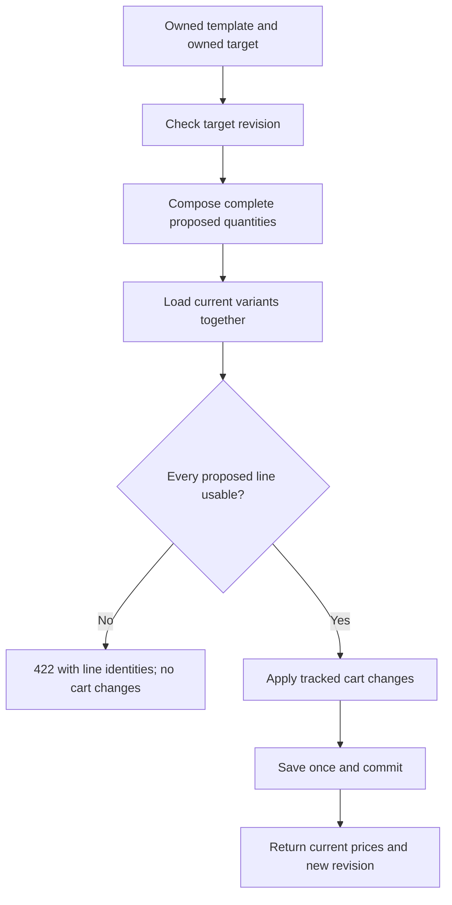

# Workshop 5f: templates store intent, the catalog supplies today's facts

Story: MS-12. [Tracker](story-tracker.md) | [Journal](journal.md) | [Previous: cart merging](05c-merging-carts-and-auditing-writers.md)

Start with the story in plain language: “Remember the things I usually buy and their quantities. When I use that list again, tell me what those things cost and whether I can buy them now.” A template outlives a particular cart. Its definition stays fixed while the catalog changes around it.

## First pass: a shopping list analogy

A note saying “two bags of coffee” expresses intent. A receipt saying “two bags at 10.00 each, bought last Tuesday” records a completed transaction. Our template is like the note. An order is like the receipt. Their data overlaps, but their authority differs.

The template remembers a variant ID, quantity, and display names. Display snapshots make a removed product understandable. They do not permit selling a missing product or honoring an old price. The current variant supplies its current price; its current parent supplies activity; current inventory supplies availability.

Say this in your own words before opening a file: **the template tells us what to try adding; the live catalog tells us whether and how it can be added.**

## Second pass: work the numbers

At creation, coffee costs 10.00 and the source cart contains two active coffees, one active mug, and eight saved filters. The template contains only coffee quantity two and mug quantity one. Filters are excluded because they are saved for later.

Later both active variants cost 12.00. The target contains three saved coffees. Applying combines three and two into five, activates that coffee line, and adds one mug. The active subtotal becomes `5 × 12 + 1 × 12 = 72`. The template still contains two coffees and one mug.

| Value | Before apply | After apply |
| --- | --- | --- |
| Template coffee quantity | 2 | 2 |
| Target coffee quantity | 3, saved | 5, active |
| Target mug quantity | Absent | 1, active |
| Current unit prices | 12.00 | 12.00 |
| Stock on hand / reserved | 100 / 0 | 100 / 0 |
| Target version | V | V + 1 |

Applying later with a fresh target revision adds again. A retry with the old revision fails with 409. Refreshing the revision and repeating is a new addition, so a client must make that decision deliberately after a lost response.

## Third pass: follow one request through the files

1. Open [CartTemplateContracts](../../src/Agora.Api/Contracts/CartTemplateContracts.cs). Apply accepts a target token and required observed revision. There is no input unit price. Circle the nullable version plus Required attribute: omission must not quietly become zero.
2. Open [CartTemplatesController](../../src/Agora.Api/Controllers/CartTemplatesController.cs). Every template lookup or delete includes the authenticated owner in the query. The route ID alone is insufficient.
3. Open [CartTemplateService](../../src/Agora.Infrastructure/Services/CartTemplateService.cs). Apply starts a local transaction, loads the owned template and owned target, and checks the revision before composing proposed contents.
4. Open [CartCombinationRules](../../src/Agora.Domain/Services/CartCombinationRules.cs). Quantities combine using a wider sum. Template additions are active, so an overlap activates an existing saved line. Validation sees the whole result, including existing target lines.
5. Open [CartCombinationWriter](../../src/Agora.Infrastructure/Services/CartCombinationWriter.cs). Only after validation does it replace contents, preserve existing target IDs, and explicitly register new children as inserts.
6. Return to the service. It saves once and commits. The response mapper reads current prices. No reservation or payment service is involved.



## A missing row must remain visible as a problem

**Actual provider failure:** the first template implementation loaded a cart with a filtered Include that took 51 active children and then included each child's variant/product. The real SQLite run rejected the translated SQL because it required APPLY. The correction first selects the owned cart ID, then queries CartItems directly with a deterministic order, Take(51), and a snapshot projection. Fifty-one is a sentinel: seeing that many proves the allowed fifty was exceeded. A LINQ expression that compiles is not necessarily executable by every relational provider. The journal distinguishes this observed failure from the pending correction run.

Suppose the template contains coffee and a discontinued mug. An inner join to current variants would discard the mug. Adding only coffee would look successful even though the requested operation was incomplete.

The service instead retains the complete definition, loads current variants into a dictionary, and checks every proposed identity. A missing variant produces a problem with `templateLineId`, `variantId`, the stored SKU, and a reason. The entire apply is rejected. A problem caused solely by an existing target line has a null template-line ID because that line did not come from the template.

Read [CartTemplate](../../src/Agora.Domain/Entities/CartTemplate.cs) and its mapping in [AgoraDbContext](../../src/Agora.Infrastructure/Persistence/AgoraDbContext.cs). TemplateLine.VariantId has no catalog foreign key. Deleting a variant preserves its explanatory snapshot. Deleting the account cascades through its templates and lines. These are different lifecycle decisions.

## Two races, explained twice

**Capacity:** an account has nine templates. A and B each want another. Counting before a protected write section could let both see nine and insert, producing eleven. Here a SQLite write transaction starts before count and insert. One creates the tenth and commits. The next writer observes ten and receives 409.

In everyday terms, counting seats and taking the last seat happen during the same turn. Counting available seats in the hallway and reserving later leaves a gap.

**Apply:** both clients saw cart version seven. A applies and writes eight. B acquires its write turn, reads eight, and rejects the expected seven. The version represents the client's observation; the transaction protects the local read/validate/write sequence. The EF concurrency token additionally protects conditional writes from stale contexts.

The persistence tests use separate connections and an explicit transaction-start barrier. Two concurrent operations on one shared DbContext would neither model independent writers nor be supported EF usage.

## Why share the writer now?

The merge workshop found a real bug: a new generated cart-item ID was discovered as an update, and updating a nonexistent row produced a concurrency failure. The correction records original target IDs and explicitly adds new children. Templates need this same operation, so it now lives in one infrastructure helper used by both services.

Pure rules still have no DbContext. The writer knows EF tracking. You can explain quantity arithmetic without a database and test insertion against a real relational provider. Extraction requires another merge regression run: a previous passing binary cannot prove a later refactor correct.

## Guided lab: predict, run, inspect

Use disposable data and two accounts. [CartTemplatesApiTests](../../tests/Agora.Tests/Integration/CartTemplatesApiTests.cs) demonstrates setup. Create with:

```http
POST /api/me/cart-templates
Authorization: Bearer <owner-token>
Content-Type: application/json

{"name":"Weekly","cartToken":"<owned-source-token>"}
```

GET `/api/me/cart-templates` lists summaries. GET `/api/me/cart-templates/{id}` reads the definition. Read the target cart's current version, then apply:

```http
POST /api/me/cart-templates/<id>/apply
Authorization: Bearer <owner-token>
Content-Type: application/json

{"targetCartToken":"<owned-target-token>","expectedCartVersion":7}
```

Seven is an example; use your observed version. DELETE `/api/me/cart-templates/{id}` removes the owned template and frees a slot.

Before each experiment, write the expected status, target quantities, revision, and stock:

1. Save at 10.00, edit the live price to 12.00, apply to an empty target.
2. Put 98 units in the target and add two more.
3. Keep one valid and one deleted variant in a template, then apply.
4. Add a saved target line in another currency, then apply.
5. Submit two applications with the same observed revision.
6. Read and delete using the other account.

Run from the repository root:

```powershell
dotnet test tests/Agora.Tests/Agora.Tests.csproj --filter "FullyQualifiedName~CartTemplate|FullyQualifiedName~CartMerge|FullyQualifiedName~CartCombination"
```

Inspect [CartTemplatePersistenceTests](../../tests/Agora.Tests/Integration/CartTemplatePersistenceTests.cs) for barriers and the upgrade. It downgrades seeded disposable data to the previous migration and migrates forward, then checks old cart/search values. EnsureCreated alone cannot prove an upgrade path.

## Check your understanding

**Why store a deleted variant's SKU?** To identify what failed. Reusing that SKU on another variant must not redirect the historical identity.

**Why include saved lines in currency validation?** The current CartResponse mapper chooses currency from its first line, including saved lines. The story's all-line currency rule keeps that representation valid.

**Why not reserve stock?** Saving and applying prepare intent. Checkout owns reservation. Successful apply does not promise stock will remain available until checkout.

**Why reject everything when only the mug is missing?** Atomic application is the contract. Partial success would require an explicit different contract, not an accidental join effect.

**What distinguishes a retry from another purchase preparation?** Reusing the same expected revision detects an already changed cart. Supplying a freshly observed revision permits another addition.

## Write your journal entry

Record one mistaken prediction and the assertion or SQL that corrected it. Draw the ownership predicates, two-writer timeline, and snapshot/live-price distinction. End with a two-minute explanation for a new teammate: “How can a saved shopping list survive a deleted product without letting me buy that deleted product?” Verification status lives in the tracker and journal; a pending run is not passing evidence.
