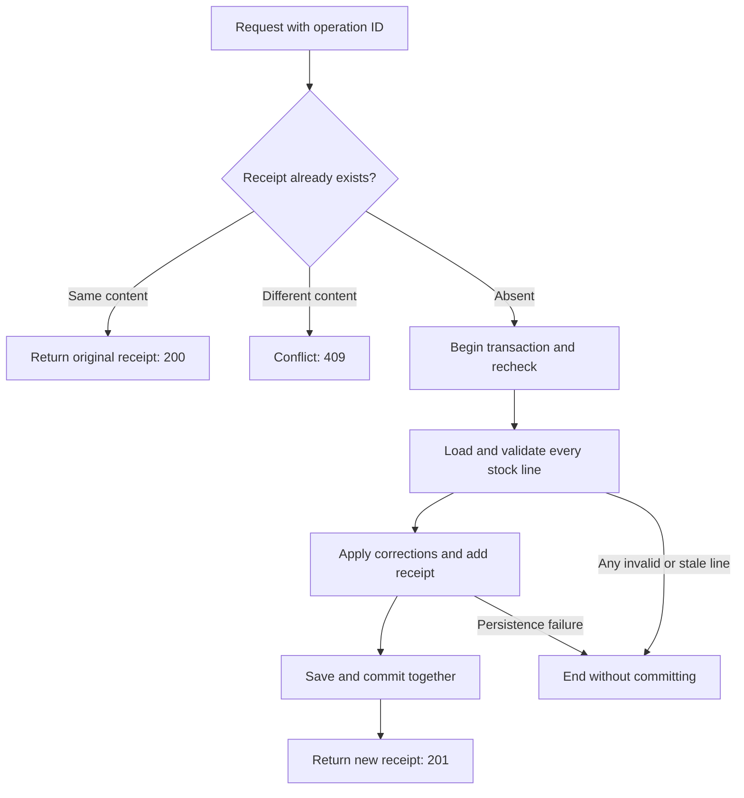

# Workshop 6d: one stock correction, one durable receipt

Story: MS-07. Check [the tracker](story-tracker.md) and [journal](journal.md) for current verification evidence. This feature concerns local stock corrections; it does not make external payment calls idempotent.

## Predict the retry before reading the code

An administrator submits two corrections: A has 10 on hand and 2 reserved, with delta -3; B has 8 on hand and 0 reserved, with delta +4. The intended result is A=7, B=12. The server commits successfully, but the response is lost. The administrator retries.

Without a saved operation identity, applying the deltas again produces A=4, B=16. Both values might pass ordinary stock validation, but they represent the wrong business outcome. A valid arithmetic operation can still be a duplicate operation.

The request therefore has a client-generated `operationId`. The database stores the original receipt under that ID in the same transaction as the stock changes. The retry returns that receipt and does not repeat the deltas.

## Three questions, three different mechanisms

| Question | Mechanism |
| --- | --- |
| Is this input well formed? | Request/domain validation |
| Has stock changed since the administrator observed it? | Expected stock revision plus EF concurrency token |
| Has this exact operation already succeeded? | Unique operation ID plus normalized-content fingerprint and saved receipt |

Do not substitute one for another. A stock revision detects stale observations but does not identify the original operation. An operation ID identifies a request but does not make a new request's stale stock values safe.

Read stock with the existing GET `/api/inventory/{sku}`. Its response now exposes the inventory `version` alongside `productVariantId` and quantities, so a client can construct a batch using an actual observation. This is the stock record's revision, not the separately versioned variant-name/price editor or reorder-policy revision. Identically named version fields on different resources are not interchangeable.

## Normalize meaning, not raw JSON bytes

Open [InventoryAdjustmentCommand](../../src/Agora.Domain/Entities/InventoryAdjustmentBatch.cs). Its factory trims the reason, validates 1–50 distinct nonempty variant IDs, rejects zero/out-of-range deltas and negative revisions, and sorts lines by a stable variant-ID representation.

The fingerprint hashes an explicitly shaped JSON value containing the normalized reason and sorted variant/delta/expected-version tuples. These requests mean the same thing:

- Reason `"  Cycle count  "`, lines A then B.
- Reason `"Cycle count"`, lines B then A.

They get the same fingerprint. Changing a delta, an expected version, or the trimmed reason changes the fingerprint. The operation ID is already the lookup key, so it is not needed inside that content hash. The authenticated actor is stored on the original receipt; a later administrator replay does not rewrite attribution.

The command factory copies and wraps the line collection. Mutating the caller's original array afterward cannot change what the command means while leaving its fingerprint behind. This is the same aliasing lesson as [draft cloning](04c-cloning-without-copying-history.md), now applied to an operation's identity.

## Trace the transaction

Read [InventoryAdjustmentService](../../src/Agora.Infrastructure/Services/InventoryAdjustmentService.cs) in this order:

1. Look up a completed operation before reading current stock. Matching content returns the original receipt. Different content under that ID is a conflict.
2. Begin the local transaction and recheck the operation. Another request may have completed between the first lookup and this transaction.
3. Load all requested inventory rows together. Missing stock records reject the whole request.
4. Validate every expected stock revision and every proposed absolute balance before changing any stock object.
5. Compute with widened, checked arithmetic. Each resulting on-hand balance must be at least reserved stock and at most 1,000,000. Reuse `InventoryItem.SetStock` for the actual mutation and revision advancement.
6. Build receipt lines from the actual before/after quantities, reserved quantities, SKU snapshots, and before/after revisions.
7. Save stock and receipt together, then commit.

The recheck has the same replay/conflict behavior as the first lookup. SQLite's default transaction reserves write access before that recheck. The unique receipt key still expresses the invariant in the database, and stock revisions protect conditional updates.

## Why replay comes before version validation

Suppose the original stock version was 4. The successful correction advances it to 5. Retrying the original request necessarily carries expected version 4.

If the server checked current stock first, it would reject the retry as stale even though the correction already succeeded. The saved receipt answers the more important first question: “Did this exact operation already finish?” Only new operations need to validate current stock.

This is also why replay works after a catalog variant is deleted. A completed receipt contains historical variant ID and SKU values and does not cascade away with catalog records. A new adjustment still requires a real inventory record.

## Failed context versus fresh context

When a competing request wins a uniqueness race, the losing transaction is disposed before reading the winner's receipt through a fresh service scope. The failed context may still contain changed entities. Do not reuse that graph as if it were a clean view of committed state.

The service catches recognized SQLite uniqueness failures for receipt recovery. Stock revision conflicts remain conflicts. Database-busy responses also return a conflict with guidance to retry the same operation ID; the service does not repeatedly reapply arbitrary commands in a hidden loop.

Say it again without framework names: after a failed write, ask the database what actually won, rather than trusting the unsaved objects still sitting in memory.

## Test a failure after work has started

[BulkInventoryAdjustmentApiTests](../../tests/Agora.Tests/Integration/BulkInventoryAdjustmentApiTests.cs) exercises new/replayed receipts, normalized ordering, changed-content conflicts, original attribution, history after catalog deletion, reserved-stock violations, missing/stale lines, malformed input, and administrator access.

[BulkInventoryAdjustmentPersistenceTests](../../tests/Agora.Tests/Integration/BulkInventoryAdjustmentPersistenceTests.cs) uses separate SQLite connections. One experiment starts two requests with the same operation ID, coordinates their initial receipt reads with an explicit interceptor barrier, and checks for one new result, one replay, one receipt, and one stock correction. Another creates a temporary database trigger that rejects a receipt-line insert after the parent receipt has been inserted. The test then checks that both the parent receipt and all stock changes rolled back. Removing that trigger allows the same operation to succeed with its original versions.

This deliberately injected database failure tests a stronger claim than input validation. Validation proves that rejected input makes no changes; the trigger proves that a failure during persistence does not leave half the operation behind.

The upgrade test checks real migrations and preserves existing stock and reorder policies. New receipt history starts empty: it does not invent receipts for old manual adjustments.

## Explain-back exercises

1. A=10/reserved=2, delta=-9. What happens to B's otherwise valid +4 correction? **Neither correction commits; A would fall below reserved stock.**
2. The first response is lost. Should the client generate a new operation ID immediately? **No; retry the same ID and same normalized content to recover the original outcome.**
3. The same ID arrives with a new reason. What happens? **409; the identity cannot be reused for different content.**
4. Why retain the original receipt instead of rebuilding it from current stock? **Later operations may have changed stock again. The receipt must describe this operation's actual before/after values.**
5. Does a valid stock revision prove this operation has never run? **No; revision and operation identity answer different questions.**
6. Why keep receipt variant IDs without a cascading catalog relationship? **Historical evidence must survive later catalog removal.**
7. What would make the same design insufficient for charging a real payment provider? **The provider call cannot be rolled back by this local database transaction; it needs its own durable coordination and idempotency design.**

In your learning log, draw the lost-response scenario twice: first without a receipt, then with one. Circle the point at which the database has committed but the client is still uncertain. That uncertainty is the reason this feature exists.
