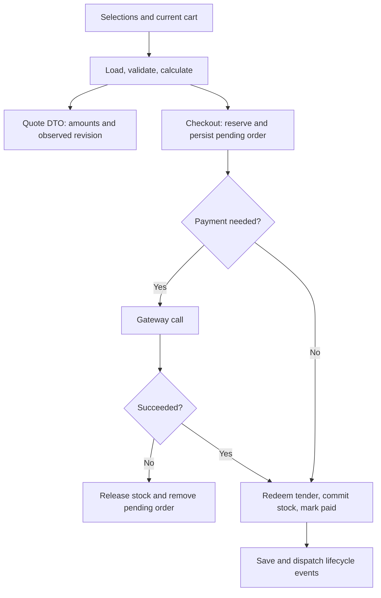

# Workshop 7a: one calculation, two different consequences

Story: MS-10. [Tracker](story-tracker.md) | [Journal](journal.md) | [Checkout storyboard](../07-checkout-storyboard.md)

A quote answers “What would this purchase cost using the facts available now?” Checkout attempts to make a purchase. The arithmetic should agree when the inputs and facts agree. The consequences should differ dramatically: a quote must leave stock, money, orders, and the cart untouched.

## Read the old flow before extracting anything

The original checkout mixed six kinds of work in one method. Label them before discussing classes:

| Kind of work | Example | Allowed during quote? |
| --- | --- | --- |
| Load | Read active cart lines, current variants, discount | Yes |
| Validate | Check address ownership and available stock | Yes |
| Calculate | Prorate discount, calculate tax and shipping | Yes |
| Mutate | Reserve inventory, redeem gift credit | No |
| Persist | Save a pending or paid order | No |
| External call | Charge gateway, send webhook | No |

The extraction moves the first three into [CheckoutPricingService](../../src/Agora.Infrastructure/Services/CheckoutPricingService.cs). [CheckoutService](../../src/Agora.Infrastructure/Services/CheckoutService.cs) consumes its result and performs the remaining steps. [CheckoutController](../../src/Agora.Api/Controllers/CheckoutController.cs) exposes the quote through the same calculator with no-tracking reads.

Think of it as a restaurant estimate and the act of placing the order. Both use the menu. Reading a menu must not send dishes to the kitchen or charge a card.

## Work a complete example by hand

Two tees cost 19.99 each. Their subtotal is 39.98. WELCOME10 computes a ten-percent discount: 3.998 rounds to 4.00. Discounted subtotal is 35.98. In the seeded US zone, the standard category rate is eight percent. Tax is `35.98 × .08 = 2.8784`, rounded to 2.88. The discounted subtotal is below the standard method's free-shipping threshold, so shipping is 5.99.

```text
Subtotal                    39.98
- Discount                   4.00
+ Tax                        2.88
+ Shipping                   5.99
= Purchase total            44.85
- Gift-card contribution    10.00
= Remaining payment         34.85
```

Gift-card contribution is tender, not a product discount. It does not reduce the tax base. With a 100.00 gift balance, contribution is 44.85 and remaining payment is zero. A quote merely reports this possibility; checkout redeems the contribution after its payment decision.

Explain the same identity another way: every cent of the purchase total must be covered by gift tender or another payment. Separately, that purchase total must equal merchandise minus discount plus tax plus shipping. These are two equations with different meanings.

## The important rounding detail

The existing pipeline calculates a rounded total discount, then derives a proportional rate from that rounded amount and the subtotal. Each tax line keeps its product tax category and discounted share. [TaxService](../../src/Agora.Infrastructure/Services/TaxService.cs) applies the zone's category rate and rounds the aggregate tax once.

Do not replace this with “tax the rounded total at one rate.” A reduced-rate product and a standard-rate product may share an order. Do not round every discounted tax share prematurely either: changing where rounding happens can change cents. [TotalsPipelineTests](../../tests/Agora.Tests/Integration/TotalsPipelineTests.cs) characterizes mixed categories, fixed-discount allocation, rounding, free-shipping boundaries, and gift tender. Those tests existed before the extraction; they are useful independent constraints on the refactor.

## Trace the current implementation

1. Inspect CheckoutPricingInput. It has selection data and no payment token. Infrastructure never references the API DTOs.
2. The calculator captures `TimeProvider.GetUtcNow()` once. Discount and gift-card eligibility use that instant.
3. It loads cart, current products, variants, and inventory. Saved-for-later lines are excluded from the active purchase.
4. It resolves address and shipping, including explicit opt-in preferences described in the next workshop.
5. It validates discount, gift currency/eligibility, and observed stock. Checking available quantity does not call Reserve.
6. It computes merchandise, discount, category tax, weight, shipping, gift contribution, and remaining payment.
7. Quote maps the result to [CheckoutQuoteResponse](../../src/Agora.Api/Contracts/CheckoutQuoteContracts.cs). Checkout begins reservations using the same result, creates its order snapshots, and follows the existing payment sequence.



The quote branch ends at the DTO. No-tracking is useful defense, but it is not proof of no side effects: code could still call ExecuteUpdate, a gateway, or another service. Tests must observe the prohibited operations directly.

## Prove absence as well as presence

[CheckoutQuoteApiTests](../../tests/Agora.Tests/Integration/CheckoutQuoteApiTests.cs) replaces payment and webhook transports with counting fakes. It creates an actual subscription so an accidental lifecycle dispatch has somewhere to send. Repeating a quote three times must leave charge, refund, and send counters at zero.

The same test captures EF commands and rejects INSERT, UPDATE, and DELETE. Fresh-context reads compare cart revision/lines, discount usage, gift balance/version, inventory on-hand/reserved, order count, and delivery count. Then immediate checkout must match the quote amounts. This combination is stronger than asserting only HTTP 200 or only an empty change tracker.

Further tests compare quote and checkout failures for a foreign saved address, invalid shipping, expired discount, expired gift card, and insufficient stock. A price-change experiment proves that checkout recalculates instead of trusting an old quote.

## A real arithmetic issue found during extraction

The old weight calculation multiplied and summed Int32 values. A legal line can contain 99 items weighing 1,000,000 grams each. Thirty such lines total 2,970,000,000 grams, beyond Int32.MaxValue. The new expression widens before multiplying: `(long)weight × quantity`, and ShippingMethod.CalculateCharge accepts long.

Casting after the multiplication would be too late if that multiplication overflowed. Widening only the sum would also leave multiplication vulnerable when bounds change. The regression fixture uses the thirty-line example and a one-unit-per-kilogram rate: shipping is 2,970,000.00. Large numbers make the bug visible; ordinary one-item fixtures would not.

## Try the endpoint and explain its limits

```http
POST /api/checkout/quote
Content-Type: application/json

{
  "cartToken":"<cart-token>",
  "email":"learner@example.test",
  "shippingAddress":{
    "fullName":"Learner","line1":"1 Practice Lane",
    "city":"Town","region":"VA","postalCode":"22201","country":"US"
  },
  "discountCode":"WELCOME10"
}
```

The response contains calculatedAt, observed cartVersion, currency, active line amounts, subtotal, discount, tax, shipping, purchase total, gift contribution, remaining payable, selected method, and total weight. It is private/no-store and nonbinding. There is no payment token in this request contract.

Between quote and checkout, another shopper may take stock, an administrator may change a price or method, a discount may expire, or gift balance may change. The revision describes the cart observation; it does not freeze every related catalog/policy record. Checkout must validate and calculate again.

The extraction preserves the existing pending-order/payment flow. It does not make a database commit and a remote payment one atomic transaction, and it does not add payment recovery. Read the later durable-integration lessons before claiming those guarantees.

## Exercises with answers

**Predict:** after three quotes, how much gift balance remains? **Answer:** all of it. A contribution is a proposed allocation until checkout redeems it.

**Predict:** a saved line has a different currency. Does it enter quote subtotal? **Answer:** no; pricing uses active lines. Active mixed currencies still fail the existing Money rule.

**Predict:** a quote succeeds at 11:59:59 and the discount expires at noon. Can checkout at noon use it? **Answer:** no; expiry is evaluated again and is exclusive.

**Refactor exercise:** find every occurrence of Reserve, Redeem, RegisterUse, SaveChanges, ChargeAsync, and DispatchAsync across the calculator and checkout. Explain why each belongs where it is. Avoid changing behavior until your map agrees with tests.

**Counterexample exercise:** invent a cart where taxing the whole discounted subtotal at the standard rate is wrong. **Answer:** any cart containing a nonzero reduced-rate or zero-rate line in a zone with different category rates.

Run the quote, totals, checkout, shipping, tax/gift, and reservation-edge suites together. Record actual results in your journal, including any mismatched cent and the rounding stage that caused it. Use the tracker for current verification status.
