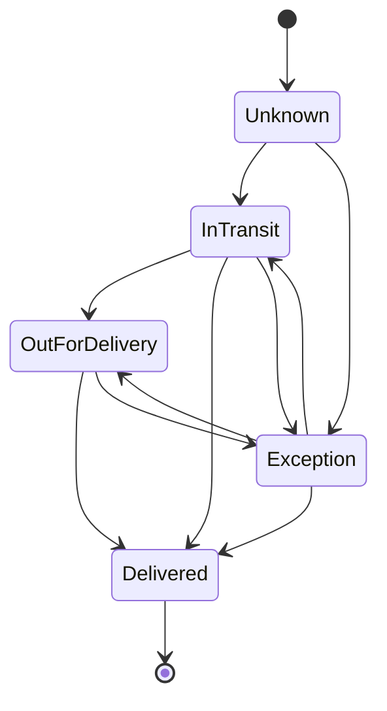

# Workshop 7d: shipment progress and private support history

Stories: MS-25 and MS-26. [Tracker](story-tracker.md) | [Journal](journal.md) | [Return eligibility](07c-return-eligibility-and-evidence.md)

These features add history to existing orders without changing what an order's purchase and fulfillment fields mean. Shipment tracking describes manually recorded carrier progress. Support notes describe internal investigation. Both record server attribution and time, but they have different readers and different rules for adding entries.

## Fulfilled and delivered answer different questions

An order is Fulfilled when its ordered quantities have complete fulfillment coverage. That is a warehouse accounting fact. A shipment marked Delivered describes carrier progress. An order can be fully fulfilled while a shipment is in transit or experiencing an exception.

Repeat it with a parcel analogy: the warehouse packed and handed over every item; the courier still has to get each parcel to the customer. Combining those into one enum would hide useful information.

The tracking feature never marks an order fulfilled, downgrades it on an exception, adjusts inventory, or calls a carrier. It records manual progress on one existing Fulfillment.

## Draw the transition rules before coding

| Current tracking state | Allowed next states |
| --- | --- |
| Unknown | InTransit, Exception |
| InTransit | OutForDelivery, Delivered, Exception |
| OutForDelivery | Delivered, Exception |
| Exception | InTransit, OutForDelivery, Delivered |
| Delivered | None |

Same-state updates are conflicts. Unknown cannot jump directly to Delivered. Exception can recover in several ways. Delivered is terminal. New and migrated fulfillments start Unknown at version zero with no historical events: the migration does not pretend to know past carrier movements.



Read [Fulfillment.RecordTracking](../../src/Agora.Domain/Entities/Fulfillment.cs). It validates the transition and message before changing state, computes the next revision, constructs one event, and then advances the parent. [ShipmentTrackingEvent](../../src/Agora.Domain/Entities/ShipmentTrackingEvent.cs) stores the immutable sequence, status, message, actor, and recorded time.

## Why keep both sequence and time?

Two accepted updates can share an identical clock timestamp. A test deliberately uses a fixed clock for InTransit → Exception → InTransit → Delivered. Timestamps alone cannot order them. Sequences 1, 2, 3, 4 express the accepted order, and the unique fulfillment/sequence index prevents duplicates.

The current parent version equals the latest event sequence in this feature. The version protects a writer's observation; the sequence orders saved history. They coincide because every accepted transition advances once and creates exactly one event.

An administrator reads GET `/api/admin/fulfillments/{id}/tracking-events`, which returns current status/version plus paged events. POST accepts:

```json
{"expectedVersion":0,"status":"InTransit","message":"Handed to the carrier"}
```

The API accepts defined names, including case-insensitive matching, but rejects numeric enum text and comma-separated combinations. A required nullable expectedVersion distinguishes an omitted field from a legitimate zero. Message is optional plain text up to 200 characters and is visible to the customer; use internal support notes for private investigation.

## Atomic history means the parent and event agree

[ShipmentTrackingController](../../src/Agora.Api/Controllers/ShipmentTrackingController.cs) begins a short local write transaction, loads the fulfillment, checks the revision, applies the domain transition, and explicitly adds the event. One SaveChanges commits parent state and child together. The parent tracking revision is also an EF concurrency token.

Suppose A and B both observed version zero. A records InTransit and commits version one. B then sees one and rejects its expected zero. The database must contain one event and a parent pointing at that event's status. It must not contain a loser event, two sequence-one events, or a parent with no corresponding event.

[OperationalHistoryPersistenceTests](../../tests/Agora.Tests/Integration/OperationalHistoryPersistenceTests.cs) tests this with separate connections and a transaction-start barrier. [ShipmentTrackingTests](../../tests/Agora.Tests/Unit/ShipmentTrackingTests.cs) tests every pair of states and verifies rejected transitions preserve the parent. HTTP tests additionally verify paging, field validation, permissions, and unchanged order/stock/provider observations.

## Customer history requires both relationships

The customer route is GET `/api/me/orders/{number}/fulfillments/{id}/tracking-events`. Its predicate checks the order number, actual owner, and fulfillment ID together. Owning order A does not let someone request a fulfillment belonging to order B through A's route.

Customer event DTOs contain ID, sequence, status, message, and recorded time. Administrator event DTOs additionally contain ActorAdminId. Read [OperationalHistoryContracts](../../src/Agora.Api/Contracts/OperationalHistoryContracts.cs) to see that distinction explicitly. Returning the entity directly would expose the actor field regardless of endpoint authorization.

History pages accept page size 1–100, default 20, ordered by sequence. The read transaction keeps the returned parent status/version and event page consistent for that read. Old Unknown records correctly return empty history.

## Internal notes are a separate audience

Admin GET/POST `/api/admin/orders/{number}/notes` stores immutable plain-text notes. Body is trimmed and must contain 1–1,000 characters. The server supplies ID, authenticated admin ID, and timestamp. Attempts to provide author/time properties are rejected by the strict request DTO.

Notes are allowed for any non-Pending order. Checkout may delete a temporary Pending order after payment decline; support should not attach operational history during that provisional stage. A note does not change order totals, status, fulfillment time, or payment state.

There is no note edit/delete endpoint, no notification, and no message sent to the customer. The actor ID is a historical value with no required live-admin navigation, so a note remains attributable when that administrator account is removed.

List pages default to 1/20, maximum size 100, ordered newest timestamp first and then ID. The ID tie-breaker matters when two administrators write at the same instant. Pagination validates widened offset arithmetic before executing SQL.

## Permission checks alone do not establish privacy

It is necessary that only administrators can call the notes endpoint. It is also necessary that note text never leaks through another response. An otherwise protected database field could be exposed later by a generic order serializer, packing-slip renderer, or webhook payload.

[OrderSupportNotesApiTests](../../tests/Agora.Tests/Integration/OrderSupportNotesApiTests.cs) writes a unique private marker, then searches customer order detail, owned order history, the timeline, packing-slip HTML, and the explicitly mapped webhook payload. The marker must be absent. It also uses two real authenticated admins to prove server attribution, deletes one admin in a fixture to prove historical retention, and checks provider counters remain zero.

Read [OrderSupportNotesController](../../src/Agora.Api/Controllers/OrderSupportNotesController.cs) and [OrderSupportNote](../../src/Agora.Domain/Entities/OrderSupportNote.cs). Note insertion saves only the note; no order mutation is required. The order FK cascades notes if the order is deleted. The separate DTO prevents incidental embedding in ordinary OrderResponse.

## A comparison to explain aloud

| Record | Reader | Changes another lifecycle? | Ordering |
| --- | --- | --- | --- |
| Tracking event | Customer and administrator; actor only admin | Advances shipment tracking only | Sequence |
| Support note | Administrator | No order lifecycle change | CreatedAt descending, ID |
| Return evidence | Actual account owner and administrator | No RMA lifecycle change | CreatedAt ascending, ID |

These records look similar because they have IDs and timestamps. Their permissions and business consequences differ. Avoid making a universal “activity” table before you can preserve those distinctions clearly.

## Exercises and model answers

**What happens after Delivered if an admin submits InTransit with the correct latest revision?** Conflict: a fresh revision does not make a forbidden transition valid.

**What happens if an admin submits an allowed transition with a stale revision?** Conflict: an allowed transition does not authorize overwriting a newer observation.

**A tracking message contains a private support detail. Does omitting ActorAdminId make that text private?** No. Tracking messages are customer-visible. Private investigation belongs in the separate note feature.

**Two notes share a timestamp. Which is first?** The deterministic ID tie-breaker decides within that timestamp; it does not claim one was physically written earlier. Tracking uses sequence when accepted order matters.

**Why migrate old fulfillments to Unknown instead of InTransit?** Existing warehouse records do not prove the carrier's state. Empty history honestly represents missing evidence.

For your journal, create one accepted and one rejected tracking timeline, and one example of an accidental private-data leak through a mapper. Explain the protection first without technical terms, then using the authorization predicate, DTO, transaction, concurrency token, and assertion that enforces it. Follow the tracker for completed verification evidence.
