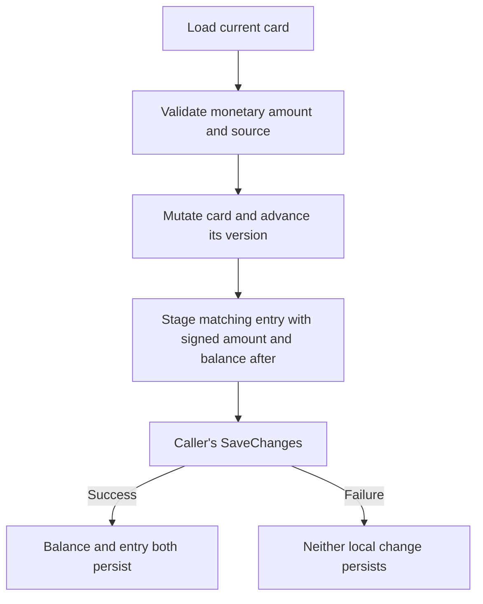

# Workshop 7e: explaining a balance without inventing history

Story: MS-29. [Tracker](story-tracker.md) | [Journal](journal.md) | [Pricing and tender](07a-quotes-and-shared-pricing.md)

A current balance answers “How much is available now?” A ledger explains which locally recorded changes led there. The two must agree. Adding a history endpoint without making each write atomic would create an attractive report that can tell an incorrect story.

## Start with three entries

Issue 50.00, redeem 20.00, then credit a 5.00 return:

| Card version | Kind | Signed amount | Balance after |
| --- | --- | --- | --- |
| 0 | Issued | +50.00 | 50.00 |
| 1 | Redeemed | −20.00 | 30.00 |
| 2 | RefundCredit | +5.00 | 35.00 |

The signs describe the balance change: issuance and credit add value; redemption removes it. BalanceAfter is a snapshot after that particular mutation. If two mutations are staged in one SaveChanges, their entries still retain the intermediate 30.00 and final 35.00 values.

Explain it another way: the balance is the answer at the bottom of your arithmetic; the entries are the visible steps. A row that says “redeemed” with a positive amount would contradict those steps, so the entry constructor validates kind/sign/source rules.

## Find every writer before introducing the ledger

The source audit found four production paths:

| Path | Existing behavior | Added accounting record |
| --- | --- | --- |
| GiftCardsController.Issue | Create a card | Issued at version zero |
| CheckoutService | Redeem positive gift tender after payment decision | Negative Redeemed with order ID |
| OrderService cancellation/full refund | Credit actual gift tender when the card exists | Positive RefundCredit with order ID |
| ReturnService approval | Credit the gift portion of an approved RMA | Positive RefundCredit with order and return IDs |

Run `rg -n 'new GiftCard|\.Redeem\(|\.Credit\(' src` yourself. The monetary calls now converge through [GiftCardAccounting](../../src/Agora.Infrastructure/Services/GiftCardAccounting.cs). This helper does not save, open a transaction, or call a provider. It stages the domain mutation and matching tracked entry in the caller's existing unit of work.

Zero gift tender creates no redemption entry. Deactivation changes no balance and creates no monetary entry. If an old workflow cannot find a referenced card and therefore performs no credit, it must not invent a credit entry. Accounting records an actual local mutation, not an intended one.

## Where atomicity comes from

Read the helper's Redeem method, then checkout's final SaveChanges. The helper advances the card's existing Version and adds a ledger row with that recorded version. EF saves both local changes together. The unique GiftCardId/RecordedVersion index prevents duplicate entries for one observed balance mutation; the existing card concurrency token prevents stale balance replacement.



Do not put SaveChanges inside the helper. Checkout also needs to save the paid order, stock commitment, discount usage, and cart change in its local unit of work. A helper that saves early could persist only part of that operation.

The entry keeps safe source IDs, not gift bearer codes, payment tokens, or provider credentials. Order/return IDs are historical references without cascading source relationships, so later source removal does not silently erase accounting history. The card relationship restricts deletion while history exists.

## A competing redemption example

A and B both read balance 50.00 at version zero. Each attempts to redeem 40.00 and prepares a version-one entry. Only one local save can win. The losing save must not add its entry or replace the winner's 10.00 balance.

[GiftCardLedgerPersistenceTests](../../tests/Agora.Tests/Integration/GiftCardLedgerPersistenceTests.cs) uses independent contexts and a barrier after both reads. The assertion is about persisted results: one saved redemption, one conflict, balance 10.00/version one, and exactly two entries including issuance. It also checks that trying to redeem 11.00 from the remaining 10.00 creates no entry.

The test establishes local balance/ledger consistency. It does not establish exactly-once behavior for an earlier remote payment. Do not automatically retry the whole checkout after a database conflict: that could repeat an external charge.

## An old card needs an opening balance

Suppose an existing card was issued with 100.00, now has 35.00, and has version two. Before this feature there were no transaction rows. We know its current balance; we do not know the complete sequence of past actions from that balance alone.

Its first ledger row is therefore:

```text
OpeningBalance +35.00, balance after 35.00, recorded version 2
```

It is not Issued +100.00. It is not a fabricated Redeemed −65.00. Many different histories could lead from 100.00 to 35.00. An opening record explicitly marks where trustworthy local history starts.

Existing fully spent cards receive a zero OpeningBalance. New cards issued through the API receive Issued, not OpeningBalance. The report exposes HistoryStartsWith and OpeningRecordedVersion so page two can still explain the beginning of the history even when its first entry is off-page.

## Migration arithmetic happens in storage units

The database stores amounts as integer cents and timestamps as UTC ticks. During backfill, copy the stored Balance column directly to entry Amount and BalanceAfter. A stored 35.00 is already 3500; multiplying by 100 again would produce an entry representing 3500.00.

The opening timestamp is the migration's recording time, not a guessed historic issuance or redemption time. The upgrade test checks an initial 100.00/current 35.00/version two card, a spent card, unchanged source balances, and the next real redemption continuing at version three.

After migration, new application writes pass through the normal cent conversion. SQL backfill works directly with provider values. Knowing which representation you are manipulating is part of writing safe migrations.

## Test a failure that happens after work has started

The persistence test installs a disposable SQLite trigger that aborts ledger insertion. It stages a redemption and attempts SaveChanges. A fresh context must still read the old card balance/version and only the old issuance entry. It separately verifies that a failed issuance leaves no new card without its entry.

After removing the test trigger, a new local operation stages redeem 20 and credit 5, then saves once. The resulting rows are +50/−20/+5 with balances 50/30/35. No gateway is called in this persistence test. It proves local rollback, not remote recovery.

This is more meaningful than a mock SaveChanges that throws before any SQL. A real relational failure exercises the transaction boundary and confirms what another connection can see afterward.

## Exercise the complete API path

[GiftCardLedgerApiTests](../../tests/Agora.Tests/Integration/GiftCardLedgerApiTests.cs) issues 50, checks out four 5.00 items with zero tax and pickup, fully fulfills them, deactivates the card, and approves a one-item return. Gift balance becomes 35.00. Inactive status blocks new redemption but does not block returning value to its source.

Other scenarios exercise paid-order cancellation and full refund with mixed tender, repeated state-transition rejection, zero gift contribution, and invalid redemption. All production paths must contribute the right source identity without adding fictional entries.

Admin GET `/api/admin/gift-cards/{id}/transactions` returns metadata and paged Entries ordered by card version ascending. Page defaults are 1/20; maximum size is 100. The ordinary gift-card response now includes its non-secret ID so an authorized administrator can navigate to this report. The report itself never selects or returns the bearer code.

The test scans the response for the exact code and the captured read SQL for the Code column. Customer requests are forbidden and anonymous requests are unauthorized. Private/no-store caching applies. There is no ledger edit/delete endpoint.

## Local accounting and remote outcomes are separate facts

A RefundCredit row proves that the application saved a local gift-card credit with a particular source reference. It is not a receipt from an external gateway. The existing order/return workflows may also call a gateway for the other tender portion; a database failure after that external action is a separate recovery problem.

Keep your explanation precise: “balance and ledger entry are atomic locally” is supported by the transaction test. “The whole checkout or refund is exactly once across systems” is not established by this feature.

## Explain it back

**Why can OpeningBalance be zero while Issued cannot?** A spent historical card still needs a truthful start-of-history record. Issuing a new zero-value card is not the supported issuance operation.

**Why record versions rather than ordering only by timestamp?** Versions connect entries to accepted balance mutations and disambiguate tied timestamps.

**Why preserve the card's original InitialBalance of 100 while opening history at 35?** InitialBalance and opening balance describe different observations at different times. Neither should overwrite the other.

**What would happen if the ledger insert succeeded but the balance update failed outside a transaction?** The report would describe a change the card does not contain. The one-save boundary prevents that partial persistence.

Write a journal entry with a before/after table for each of the four writer paths. Then draw a failure between the remote action and local save, and explain which guarantees the ledger provides and which remain outside its scope. The tracker and journal carry actual verification results; the presence of this workshop alone is not a passing test result.
