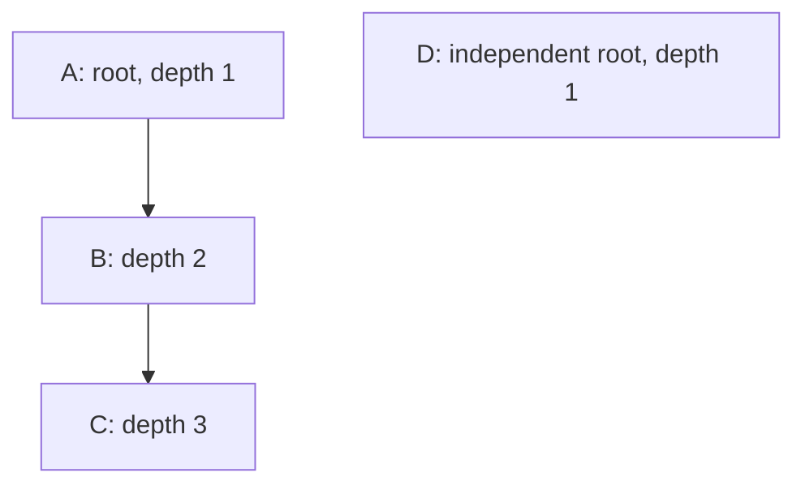

# Workshop 8a: a category move changes a graph

Story: SS-02. [Tracker](story-tracker.md) | [Journal](journal.md) | [Earlier category queries](02-queries-and-counterexamples.md)

Changing one ParentCategoryId looks like a small row update. The rule it must preserve belongs to the whole category tree: no loops, every parent exists, and no root-to-node path exceeds ten levels. This is a useful step from implementing an endpoint to reasoning about all the writers that can affect an invariant.

## Draw the smallest useful example



Moving B under D is valid. C's breadcrumbs become D/B/C, and C remains in B's subtree. Moving A under C is invalid: A would lead to C, then B, then A again when following parents. A check that only rejects `newParentId == categoryId` misses this longer loop.

Repeat the problem without graph vocabulary: a folder cannot be placed inside one of its own descendants. Even though you edit one folder's parent, every folder below it moves with it.

## Depth includes the entire moved branch

Root depth is one. If B has child C, the branch rooted at B has height two. Placing B under a node at depth nine puts B at ten and C at eleven. B's own depth is acceptable; the final tree is not.

| New parent's depth | Branch height | Deepest resulting depth |
| --- | --- | --- |
| 1 | 2 | 3 |
| 8 | 2 | 10, allowed |
| 9 | 2 | 11, rejected |

Instead of checking a special-case formula only at the moved node, the implementation replaces that parent in a proposed map and validates the entire resulting topology. This naturally checks all descendants and unrelated legacy problems too.

## Read the pure algorithm slowly

Open [CategoryTreeRules](../../src/Agora.Domain/Services/CategoryTreeRules.cs). Its input is a dictionary from category ID to nullable parent ID. Names, slugs, products, HTTP, and EF are irrelevant to the topology calculation.

For each unresolved node, it walks upward iteratively. A per-walk visited set detects revisiting an ID. A missing dictionary key identifies a missing parent. Reaching a root starts at depth zero before walking the collected path backward and assigning root depth one. Reaching a previously resolved node reuses its cached depth.

No recursion is used. A legacy 5,000-node chain does not consume 5,000 stack frames. Resolved depths are memoized so the same ancestor path is not recomputed independently for every descendant. Invalid paths receive null depth; the algorithm records diagnostics instead of inventing breadcrumbs.

The maximum input is 5,000 categories. Database reads take 5,001 as a sentinel; the extra row proves the bound was exceeded and produces 422 CategoryLimitExceeded. This implementation deliberately refuses a larger tree instead of loading an unbounded graph into memory.

## Why one revision belongs to the tree

Imagine two independent roots, A and B, at tree version zero:

| Writer | Observed graph | Proposed change |
| --- | --- | --- |
| First | A and B are roots | Put A under B |
| Second | A and B are roots | Put B under A |

Each proposal is valid by itself. Together they create a loop. If only the moved category had a version, these writers would update different rows and both could succeed. A per-row conflict check would miss the shared graph invariant.

[CategoryTreeState](../../src/Agora.Domain/Entities/CategoryTreeState.cs) stores a singleton global version. All topology writers participate. A move accepts expectedTreeVersion; a competing move with an older observation receives 409. The database also treats the global version as a concurrency token.

In plain language, the permission to reorganize the shelves is based on a picture of the whole arrangement. Updating different labels does not mean two rearrangements are compatible.

## Trace the write protocol

[CategoryTreeService](../../src/Agora.Infrastructure/Services/CategoryTreeService.cs) performs this sequence:

1. Begin a short local write transaction.
2. Read the singleton state and the bounded category map.
3. For the new move endpoint, compare the client's observed tree version.
4. Build the proposed map and validate it completely.
5. Change the actual parent, advance the global version, and save together.
6. Commit and return the category plus resulting tree version.

A same-parent move checks the supplied revision and validates the graph, but does not advance the version when topology is unchanged. Names, slugs, descriptions, and product CategoryId assignments are not changed by a move.

The existing [CategoriesController](../../src/Agora.Api/Controllers/CategoriesController.cs) create/update/delete routes now call the same service. They do not gain a required revision field, preserving their request contracts, but they acquire the same transaction and validate the final topology. Creation/deletion and actual parent changes advance the global version. A metadata-only update does not change this topology revision.

This writer audit is essential. A safe new move endpoint is ineffective if the older PUT can still create A→B→C→A. Existing slug uniqueness and in-use deletion restrictions remain enforced. A category with products or children cannot be deleted through the old route.

## Reads expose evidence, not guessed repairs

Admin GET `/api/admin/category-tree` returns Version, IsValid, Issues, and flat Nodes with parent IDs and nullable depths. Nodes are sorted by name then ID, which also gives deterministic sibling order when grouped by parent. The flat shape avoids deeply nested serialization for invalid data.

Admin GET `/api/admin/category-tree/integrity` returns the revision, validity, issues, and node count without the node payload. Ordinary legacy consistency problems appear as diagnostics. A tree above the supported node cap returns 422.

Public GET `/api/categories/{id}/breadcrumbs` returns root-to-current nodes for a valid path. Unknown category is 404; a cyclic, missing-parent, or overdeep requested path is 422. A valid branch can still be read when a different legacy branch has a problem. Breadcrumbs never fabricate a root or silently detach a node.

## A concrete move request

First read the admin tree and retain its returned version. Then:

```http
POST /api/admin/categories/<B-id>/move
Authorization: Bearer <admin-token>
Content-Type: application/json

{"newParentCategoryId":"<D-id>","expectedTreeVersion":4}
```

The IDs above are placeholders. Use a real GUID and the actual observed version. To make B a root, explicitly send `newParentCategoryId: null`; omitting that property is rejected so an incomplete body cannot accidentally detach a branch. Omitting or supplying a negative expected revision is also invalid.

Invalid topology returns 422 with structured issues such as Cycle, MissingParent, and DepthExceeded. Stale version and existing slug/in-use conflicts return 409. New write routes are admin-only; the existing public category reads remain public.

## Upgrade and explicit legacy remediation

The migration creates and seeds only the singleton revision row. It does not inspect and arbitrarily repair categories. Existing IDs, parents, names, slugs, and product assignments remain unchanged.

Use this remediation workflow when diagnostics find old invalid data:

1. Read the integrity report and full bounded tree. Save the diagnostic IDs and current revision in a review note.
2. Draw the affected branch. Identify the intended parent from domain knowledge; the API cannot infer merchandising intent.
3. If one explicit move can make the entire resulting tree valid, submit that move with the current revision. For example, detaching one chosen node of a simple cycle to a root can repair that cycle.
4. Re-read integrity and breadcrumbs, then verify product assignments.
5. For multiple independent problems that cannot be repaired by one valid move, prepare a reviewed maintenance migration with the intended final map and rollback/verification steps. Do not repeatedly guess parents or delete categories to silence diagnostics.

An unrelated ordinary edit is blocked if its resulting whole tree is still invalid. This is intentional: the write protocol preserves a valid final topology. Read-only diagnostics remain available so invalid legacy data is explainable.

## Read the proof, not just the happy path

[CategoryTreeRulesTests](../../tests/Agora.Tests/Unit/CategoryTreeRulesTests.cs) covers loops, missing parents, a 5,000-node deep chain without recursion, the size bound, and subtree-height overflow.

[CategoryTreeApiTests](../../tests/Agora.Tests/Integration/CategoryTreeApiTests.cs) exercises A/B/C and D, the old PUT bypass attempt, revision changes from old writers, null-parent moves, unchanged product assignments, depth eleven, diagnostic legacy loops, and the 5,000/5,001 boundary.

[CategoryTreePersistenceTests](../../tests/Agora.Tests/Integration/CategoryTreePersistenceTests.cs) races the incompatible A-under-B and B-under-A moves using separate connections and a barrier. It also proves that a stale global-state save rolls back its category change. The upgrade fixture deliberately retains a legacy loop, reports it, and repairs it only through an explicit valid move.

## Teach it back in two minutes

**Why is a parent foreign key insufficient?** Every referenced row can exist while their parent pointers form a loop.

**Why is checking only the moved node's depth insufficient?** Its descendants move too and may cross the limit.

**Why not use only a version on the moved category?** Two different row changes can jointly violate one graph invariant.

**Why keep diagnostics instead of fixing old data during migration?** A loop reveals a consistency problem, but it does not reveal the intended business hierarchy.

Write a journal entry containing the two-root race, a depth-ten/depth-eleven counterexample, and the source paths of every parent writer. Explain first as a folder move and then as a transaction plus invariant. Consult the tracker for actual verification results.
