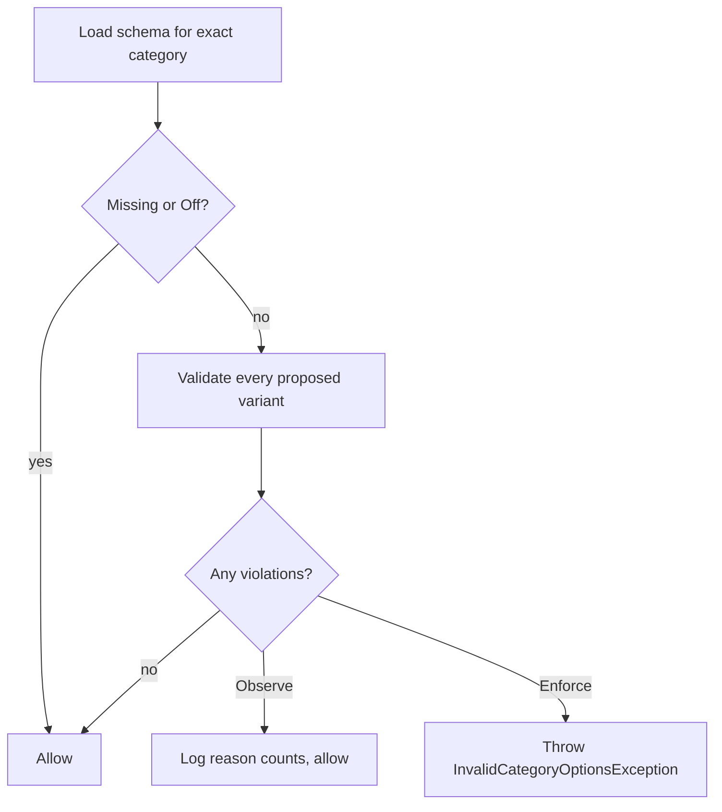

# Workshop 08b: Category option schemas and safe rollout

This workshop teaches one feature three times: first as a shop-floor analogy, then as a request flow, and finally as a set of invariants. Repetition is intentional. If one explanation feels abstract, move to the next and return later.

## The problem in ordinary language

One category may use `size=S|M|L`; another may use `capacity=128GB|256GB`. A plain dictionary can store either shape, but it cannot say which shape is appropriate. Without a category rule, `Size`, `size`, and `sizes` slowly become three different keys and reports become unreliable.

Think of the schema as a form posted above a packing table:

- **Off** means the form is stored away. Workers may use old habits.
- **Observe** means the form is posted and mistakes are counted, but work continues.
- **Enforce** means new or changed labels must match the form.

The rule controls authoring. It does not erase old stock, hide it, or stop customers buying it.

## The same idea as a traffic-light rollout

Imagine introducing a new road rule:

| Mode | New write with `size=XL` when only S/M/L are allowed | Existing XL product | Violations report |
|---|---:|---:|---:|
| Off | allowed | readable and purchasable | schema absent means empty report |
| Observe | allowed and counted | readable and purchasable | shows XL |
| Enforce | rejected with 422 | still readable and purchasable | still shows XL |

Observe is the yellow light. It gives administrators evidence before they turn on the red light. Enforce is deliberately not a retroactive repair job.

## The same idea as three separate engineering questions

1. **What is a valid rule?** Pure domain code answers this without HTTP or a database.
2. **When is the rule applied?** Application services apply it to authoring commands.
3. **How is a rule changed safely?** The API and database use a revision so two administrators cannot silently overwrite one another.

Keeping these questions separate is the core design skill in this story.

## Read the code from the center outward

Start at `CategoryOptionSchemaRules.Normalize`. It turns administrator input into one canonical representation:

```text
" SIZE " -> "size"
["S", "L", "M"] -> ["L", "M", "S"]
```

Keys are lowercase ASCII after trimming. Values are trimmed, sorted, and compared with ordinal rules. Ordinal means casing remains meaningful: `M` and `m` are different permitted values.

Next read `CategoryOptionSchemaRules.Validate`. It compares one variant dictionary with normalized rules and returns stable reason codes:

- `RequiredKeyMissing`
- `UnknownKey`
- `ValueNotAllowed`
- `InvalidKey`
- `DuplicateKey`

It returns data rather than formatting an HTTP response. That makes the same rule usable by product creation, category moves, cloning, option editing, imports, reports, and tests.

Then read `CategoryOptionSchemaService.ValidateAuthoringAsync`. Its control flow is short:



Finally follow callers such as product creation and variant editing. The transaction begins before the schema read and stays open through the catalog save. That boundary matters because a concurrent administrator could otherwise publish Enforce after a writer read Observe but before it saved invalid data.

## Trace one product creation by hand

Suppose the schema is:

```json
{
  "mode": "Enforce",
  "rules": [
    { "key": "size", "required": true, "allowedValues": ["S", "M", "L"] }
  ],
  "expectedRevision": 0
}
```

The client submits two variants:

```text
SKU-A options { size: M }
SKU-B options { size: XL }
```

The validator first checks both candidates. SKU-A has zero violations. SKU-B has `ValueNotAllowed`. The service throws before either variant is added. The correct database result is zero new products, zero variants, and zero inventory rows.

Say that again in a different way: this is batch validation, so one bad child rejects the whole parent. A loop that saves SKU-A before checking SKU-B would violate the story.

## Why existing bad data survives Enforce

An upgrade may find thousands of old variants with `Size=Medium`, `size=M`, or `material=cotton`. Automatically rewriting them would guess business meaning. Automatically hiding them would change the storefront. Automatically blocking checkout would turn an authoring cleanup into an outage.

The safer sequence is:

1. publish Observe;
2. inspect bounded violations;
3. repair rows intentionally;
4. publish Enforce;
5. validate future option changes and category moves.

Existing rows remain grandfathered until a command touches the governed choice. A price-only edit with identical options does not become an accidental cleanup requirement.

## Revision arithmetic

A missing schema has no revision. Creation therefore requires `expectedRevision: null` and creates revision 0.

```text
no row + null -> revision 0
revision 0 + expected 0 -> revision 1
revision 1 + expected 0 -> 409 Conflict
```

The stale writer reloads and decides again. The server does not silently merge rule vocabularies because “merge” could change which values are permitted.

## Why the report filters before it pages

Assume variants sorted by candidate order are:

```text
A valid
B valid
C invalid
D invalid
```

With page size 1, paging candidates first would produce empty page 1 and empty page 2. Users might conclude the category is clean. The implementation reads a bounded candidate set, validates all of it, removes valid candidates, sorts violations by SKU and ID, counts them, and only then returns a page. Page 1 is C and page 2 is D.

The 10,001-row sentinel proves the read is bounded. Ten thousand candidates are supported. Seeing the sentinel means the report returns 422 rather than silently publishing incomplete evidence.

## Security and privacy pass

Schema administration and violations are admin-only. Responses use `private, no-store`. Observe logs counts grouped by reason; it does not log complete option dictionaries, SKUs, or product payloads. Even plain-text option values may contain commercially sensitive labels, so metrics should answer “how many and why?” rather than “show me everything in logs.”

## Concurrency pass

There are two concurrency problems:

1. Two admins replace revision 0 at the same time. The revision token lets one win and makes the other reload.
2. A product write races with publishing Enforce. The local write transaction serializes the schema read and product save, producing an order: either the product commits while Observe is current, or Enforce commits first and the product is rejected.

The system does not promise distributed serialization across multiple databases. The claim is local to this SQLite-backed application boundary.

## A real migration-review catch from this workshop

The first generated option-schema migration was created from a compiled model whose migration snapshot did not yet include the category-tree change. The generated `CategoryOptionSchemas` migration therefore tried to create `CategoryTreeStates` a second time. Either migration looked plausible when read alone; the ordered pair was invalid because the second would fail with “table already exists.”

The fix was to remove the repeated tree operations from the option-schema migration and keep its model metadata aligned with the full current model. The lesson is broader than this particular table: generated migrations are code, and reviewing only the newest entity is insufficient. Read `Up`, read `Down`, and compare them with the immediately previous migration in the order production will apply them. Then run a real upgrade test from that previous migration.

Say it another way: a green compile proves the migration class is valid C#. It does not prove the sequence of database operations is valid SQL for an existing database.

## Tests as executable reading notes

Read the dedicated tests in this order:

1. `CategoryOptionSchemaRulesTests` teaches normalization, ordinal values, reason codes, and bounds.
2. `CategoryOptionSchemaApiTests` teaches Off/Observe/Enforce, grandfathering, atomic product rejection, exact revisions, authorization, and filter-before-page behavior.
3. `CategoryOptionSchemaPersistenceTests` teaches migration compatibility, ownership cascade, and optimistic concurrency.

A useful habit is to cover the test name, predict the outcome, and then uncover it. When your prediction differs, write down which invariant you misunderstood.

## Debugging checklist

When a schema test fails, ask these questions in order:

1. Was administrator input normalized before storage?
2. Was the schema selected by the product's exact category, without parent inheritance?
3. Did the caller supply every proposed variant before mutation?
4. Was validation skipped only for missing/Off schemas or unchanged options?
5. Did Observe permit the write and emit only structured counts?
6. Did Enforce throw before database mutation?
7. Did the transaction cover both schema lookup and catalog save?
8. Did the report filter before paging and stop at 10,001 candidates?

## Exercises

### Exercise 1: predict normalization

Normalize rules `Color -> [" blue ", "Red"]` and ` SIZE -> ["S", "L", "M"]`. Write the exact stored order.

### Exercise 2: classify violations

The only required rule is `size=[S,M,L]`. Classify `{material: cotton}` and `{size: m}`.

### Exercise 3: explain grandfathering

An XL product existed before Enforce. Explain why GET and checkout still work, while changing its options to XXL fails.

### Exercise 4: find the paging bug

Four candidates are valid, valid, invalid, invalid. What goes wrong if page size 2 is applied before validation?

### Exercise 5: draw the race

Draw a timeline for a product writer reading Observe while an administrator publishes Enforce. Mark the transaction boundary that prevents the writer from committing afterward based on the stale mode.

### Exercise 6: extend safely

An import feature creates 50 products. Where should it call the validator, and what must happen if product 49 violates a rule?

## Answers

### Answer 1

Rules sort by key: `color` then `size`. Color values sort ordinally as `Red`, `blue`; size values are `L`, `M`, `S`. Value case is preserved.

### Answer 2

`{material: cotton}` has `UnknownKey` for material and `RequiredKeyMissing` for size. `{size: m}` has `ValueNotAllowed` because allowed-value comparison is case-sensitive ordinal.

### Answer 3

Enforce guards new authoring decisions, not historical reads or purchases. The old XL row remains usable. An option change is a new authoring decision, so the complete resulting options must satisfy the current schema.

### Answer 4

Pages 1 and 2 would each validate only their two candidates. Page 1 looks empty even though the full result has violations, and totals become inconsistent. Validate/filter the bounded full set before paging.

### Answer 5

The product transaction starts before reading the schema and ends after saving the product. The publication transaction cannot slip between those two steps. Whichever transaction serializes first defines the rule seen by the product write.

### Answer 6

Build and validate all proposed variant candidates inside the import commit transaction before adding any product graph. If product 49 fails, all 50 remain uncommitted and the response identifies the offending row/variant safely.

## Journal prompts

- Which invariant belongs in pure domain code, and which belongs at the transaction boundary?
- What production harm could retroactive enforcement cause?
- Where else in this codebase do we use “observe before enforce”?
- What evidence would convince you that no writer bypasses the shared validator?
- How would the design change if schemas inherited from parent categories?

When you can explain the feature as a packing-table form, a traffic-light rollout, and a transaction invariant, you understand the same design at three useful levels.
