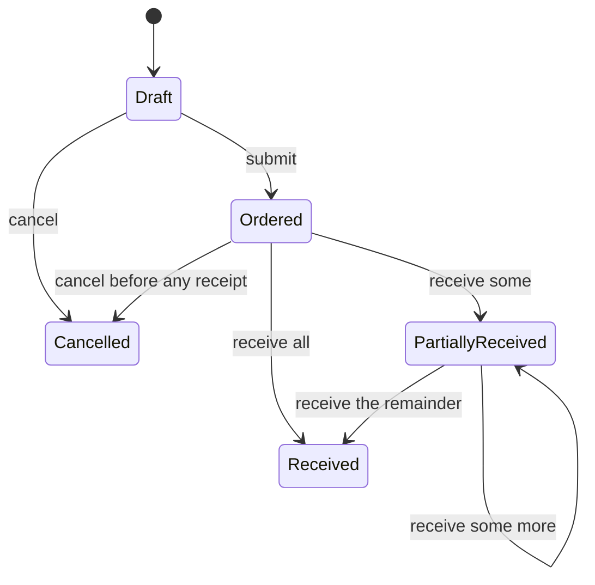

# Workshop 08c: Purchase orders, receipts, and atomic stock

This workshop teaches how to model a business document that causes a second aggregate to change. A purchase order says what we asked a supplier to deliver. A receipt says what physically arrived. Inventory says what the application currently believes is on hand. These three facts are related, but they are not interchangeable.

## Start with the story in ordinary language

Suppose a PO contains ten units of SKU A and five units of SKU B. The supplier first delivers four A. The durable facts become:

| Line | Ordered | Received | Remaining |
|---|---:|---:|---:|
| A | 10 | 4 | 6 |
| B | 5 | 0 | 5 |

The PO is `PartiallyReceived`, and A's on-hand stock rises by four. A later delivery of six A and five B makes both remaining values zero, so the PO becomes `Received`.

Read that again from the inventory side: the first delivery is an inventory increase with a durable explanation. A manual adjustment also changes inventory, but its explanation is “an operator corrected the balance.” A supplier receipt's explanation is “these exact PO lines arrived under this operation ID.” Keeping both mechanisms prevents a correction from masquerading as a delivery.

## The state machine

There is deliberately no arrow out of `Received` or `Cancelled`. There is also no cancellation arrow after a receipt. Reversing a physical receipt needs its own explicit future workflow; silently cancelling would leave stock without an honest source.

## Trace the implementation three ways

First, trace nouns. `Supplier` owns current supplier status. `PurchaseOrder` owns lifecycle and revision. `PurchaseOrderLine` owns ordered and accumulated received quantities. `PurchaseOrderReceipt` is the immutable command receipt. `InventoryItem` remains the owner of stock.

Second, trace a request. `POST /api/admin/purchase-orders/{id}/receipts` authenticates an admin and maps the DTO to sorted line changes. `PurchaseOrderService.ReceiveAsync` checks an existing operation before checking the current PO revision. For a new operation it opens a transaction, validates every line, applies every line, adds the immutable receipt, and saves once.

Third, trace failure. If line B would over-receive, validation stops before line A changes. If a stock integer would overflow, nothing changes. If persistence fails after the in-memory objects were changed, the transaction rolls back all database changes. The next HTTP request gets a fresh context and sees the old durable values.

## Why replay lookup comes first

The first receipt expects PO revision 1. It succeeds and advances the PO to revision 2. A client loses the response and retries revision 1 with the same operation ID and content.

If code checks revision first, it returns a false conflict. If it checks the immutable receipt first, it finds the completed operation, compares the fingerprint, and returns the original receipt without restocking.

The fingerprint contains the PO ID, expected revision, and line IDs/quantities in a stable sort order. Reordering JSON lines therefore represents the same command. Changing quantity or PO represents different content and returns a conflict. The operation GUID is an idempotency key, not a magic duplicate detector; the fingerprint gives the key meaning.

## Whole-command validation

The service deliberately has a validate phase and a mutate phase.

During validation it proves:

1. the PO exists and is submitted;
2. the expected revision matches;
3. every requested line belongs to this PO;
4. every historical line still points to a live variant and stock row;
5. every quantity is positive and within the remaining amount;
6. every resulting stock value and version can be represented.

Only after all six pass does it call `AddReceived` and `InventoryItem.Restock`. This structure is easier to review than interleaving “validate A, change A, validate B.” A database transaction would still roll back an exception, but keeping invalid commands from mutating tracked objects makes reasoning and tests clearer.

## Concurrency in plain language

Two workers may both see five remaining units and both try to receive five. The PO revision is an optimistic concurrency token. Both start from the same revision; at most one update can commit. Inventory has its own version token as a second safeguard. The unique receipt operation ID handles two copies of the same request.

These safeguards have different jobs:

| Safeguard | Question answered |
|---|---|
| PO revision | Did document progress change after I read it? |
| Inventory version | Did stock change after I read it? |
| Operation-ID uniqueness | Has this logical receipt already committed? |
| Transaction | Can document, receipt, and stock commit as one unit? |

## Historical snapshots and deletion

PO and receipt lines store SKU and variant-name snapshots. Their variant foreign key is nullable and uses `SET NULL`. Deleting a catalog variant removes the current link while keeping the historical statement. A pending PO with a deleted variant cannot be received because there is no live inventory target. A completed receipt remains readable.

A snapshot answers “what did this document call the item then?” A foreign key answers “which current item does this refer to now?” Mature systems often need both answers.

## Read the code in this order

1. `SupplierPurchaseOrder.cs`: state transitions and immutable receipt shape.
2. `WarehouseDocumentConfigurations.cs`: concurrency tokens, unique constraints, and deletion behavior.
3. `PurchaseOrderService.cs`: transaction boundary, replay order, validation, and mutation.
4. `WarehouseDocumentContracts.cs`: bounded external inputs and historical outputs.
5. `PurchaseOrdersController.cs`: routes, authentication, and 201 versus replayed 200.
6. `WarehouseDocumentTests.cs`: fast state-machine examples.
7. `WarehouseDocumentsApiTests.cs`: HTTP plus durable stock observations.

## Exercises

1. Order 10 A and 5 B. Receive 4 A. Write status, revision change, and remaining quantities before looking at a test.
2. Retry that request with its line array reversed. Should it restock?
3. Reuse its operation ID with quantity 5 A. Which invariant rejects it?
4. Explain why deactivating a supplier blocks new POs but not receipts for an already submitted PO.
5. Find the last point in `ReceiveAsync` before tracked values mutate. Add a debugger breakpoint and inspect the complete validated proposal.
6. Design a return-to-supplier feature. Which new document would you add rather than subtracting received totals?

## Answers

1. `PartiallyReceived`; the revision advances once; A has 6 remaining and B has 5.
2. No. Canonical sorting gives the same fingerprint, so replay returns the stored receipt.
3. The stored fingerprint differs, so reuse of the operation ID returns a conflict.
4. Deactivation is a rule for starting a new commercial commitment. A submitted commitment and delivered goods still need to be recorded honestly.
5. It is immediately before constructing receipt lines and calling `AddReceived`/`Restock`.
6. Add an immutable supplier-return document with its own operation identity and stock deduction rules. Rewriting receipt history would destroy the audit trail.

## Journal prompts

- Draw the aggregate boundaries without looking at the diagram.
- Explain idempotency to a teammate using the lost-response retry.
- List one failure protected by each of the four safeguards in the table.
- Write why a receipt is more than an inventory delta in two different ways: once for an engineer and once for an operations lead.

The current scope ends at local stock provenance. It does not send supplier messages, value inventory, reconcile invoices, or guarantee anything in an external accounting system.
