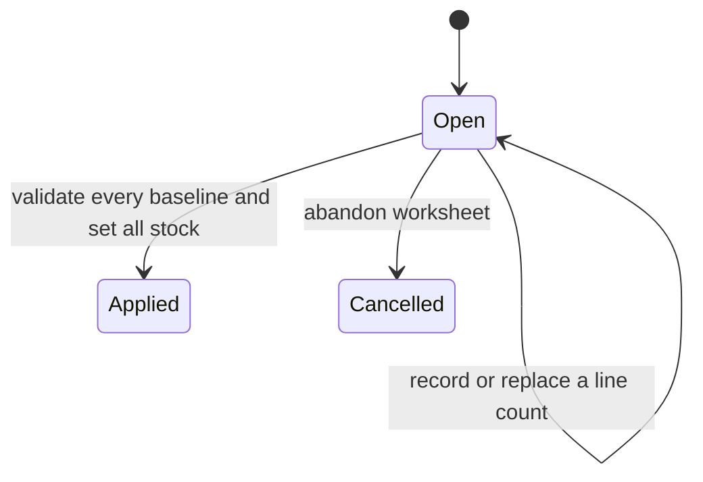

# Workshop 08d: Inventory count sessions and stale observations

This workshop teaches a subtle rule: a plausible number can still be unsafe to apply. A physical count is an observation made against a particular stock version. If a sale, refund, receipt, or correction changes stock afterward, the observation is stale even when its number looks reasonable.

## Define what the team counts

In this repository, paid units are deducted from on-hand stock before fulfillment. A count therefore records the stock represented by `QuantityOnHand`, including units reserved by a checkout that has not committed, and excluding paid units awaiting shipment. Counting every physical box in the building would use a different accounting definition and could overstate application stock.

Repeat the distinction:

- physical location answers “where is the box?”;
- application on-hand answers “does this system still own the box as sellable stock?”;
- reserved answers “how much on-hand is temporarily promised?”;
- available is `on-hand - reserved`.

A written counting instruction is part of correctness, not merely training material.

## A worked example

The baseline is on-hand 10, reserved 2, inventory version 7. The counter records 9. If version 7 is still current, applying produces on-hand 9, reserved 2, available 7, and difference -1. `SetStock(9)` advances the inventory version.

Why must count 1 fail? Two units are reserved. Setting on-hand below reserved would claim fewer owned units than already promised.

Why can count 9 fail? If checkout changed version 7 to version 8 after the worksheet was opened, the nine belongs to an older world. The operator must start a fresh session and recount. Automatically adding the intervening database delta assumes the counter and database observed the same events, which the system cannot prove.

## Session state machine

`Applied` and `Cancelled` are terminal. Editing a line advances the session revision but does not touch stock. Applying advances it again and stores actor, time, applied value, and difference. An apply retry reads an already applied session first and returns its stored result.

## Two versions, two meanings

Each line stores an inventory baseline version. The parent stores a session revision.

| Token | Protects against |
|---|---|
| Inventory baseline version | sale, receipt, refund, or correction after counting began |
| Session revision | two operators editing/applying the same worksheet state |

Do not merge them into one number. Inventory can change without a worksheet edit. A worksheet can change without inventory changing.

## The apply algorithm in three passes

Pass one loads the session and returns stored results if it is already applied. This makes a lost-response retry harmless.

Pass two validates under a short transaction. It checks expected session revision, open status, complete counts, live variant/inventory rows, exact baseline versions, counts at least as large as current reserved values, and available next inventory revisions. It collects conflicts across all lines before any mutation.

Pass three calls `SetStock` for every line, records each applied balance and difference, marks the parent applied, and saves once. One failing database write rolls back every line and the parent receipt fields.

Another way to remember it is **observe, prove, reconcile**:

1. Observe immutable baselines when the session starts.
2. Prove those observations are still current when applying.
3. Reconcile all selected balances in one commit.

## Why no automatic rebase

Suppose baseline is 10 and the counter sees 9. A sale then changes the database to 9. Adding the sale delta to the count would produce 8. That might be correct if the counter counted before the sale's unit left the shelf. It might be wrong if the counter counted afterward. The application has no timing evidence about that physical observation. Returning 409 and requesting a new count is the honest result.

## Historical deletion behavior

Count lines store SKU plus a nullable variant reference. A deleted variant does not erase an old applied worksheet. An open worksheet containing that variant cannot apply because there is no current inventory row to reconcile. This is the same snapshot-versus-live-reference pattern used by purchase-order lines.

## Atomicity thought experiment

Session A contains variants X and Y. X is current, but Y's inventory version is stale. Applying X while rejecting Y would leave a worksheet whose meaning is unclear: was it one count or two? The feature promises a session-level decision, so one stale line leaves X unchanged too.

This all-or-nothing boundary is a product choice. A future warehouse-wide system might partition by aisle or count zone, but it would need explicit partitions and receipts rather than accidental partial saves.

## Read the code in this order

1. `InventoryCountSession.cs`: parent/line state and revisions.
2. `WarehouseDocumentConfigurations.cs`: historical relationship and concurrency mapping.
3. `InventoryCountService.cs`: baseline query, staged edits, validation passes, and single save.
4. `InventoryCountsController.cs`: admin routes and actor capture.
5. `WarehouseDocumentContracts.cs`: worksheet inputs and visible audit fields.
6. `WarehouseDocumentTests.cs`: state transitions without HTTP.
7. `WarehouseDocumentsApiTests.cs`: reconciliation and stale-session scenarios.

## Debugging walkthrough

Create a one-line session and inspect `BaselineOnHand`, `BaselineReserved`, and `BaselineVersion`. Record a different count and query inventory: it must be unchanged. Put a breakpoint before the validation loop in `ApplyAsync`. Change inventory in another request. Resume apply and observe the version conflict. Then create a new session; its baseline should include the newer inventory state.

When diagnosing a production 409, compare facts in this order: session status, submitted session revision, line completeness, current inventory row existence, baseline/current inventory versions, then counted/current reserved quantities. This ordering mirrors the business decision and keeps logs useful.

## Exercises

1. Baseline 10/reserved 2/version 7, count 9, unchanged inventory. Calculate the result.
2. Use the same values but advance live version to 8 without changing on-hand. May apply proceed?
3. Explain why entering a count does not call `SetStock`.
4. Two lines are counted; one is stale. What changes durably?
5. An apply succeeds but the HTTP response is lost. What must a retry return?
6. Compare this feature with a manual delta adjustment in one sentence and then in a full paragraph.

## Answers

1. On-hand 9, reserved 2, available 7, difference -1, with a new inventory version.
2. No. Equality of quantities does not prove equality of histories; the version is the freshness evidence.
3. Entry is a staged observation. Immediate mutation would make an unfinished worksheet alter sellable stock.
4. Nothing. The entire application is rejected before mutation.
5. The stored applied worksheet/receipt fields, without another stock change, even if the submitted revision is now old.
6. A delta expresses an intentional change; a count reconciles an observed absolute value only while its baseline remains current. The longer explanation should mention baseline values, inventory versions, complete sessions, reserved bounds, and atomic application.

## Journal prompts

- Explain “a numerically plausible count can still be stale” using your own numbers.
- Draw both revision timelines on paper and label which actions advance each.
- Describe the physical counting instruction to someone in a warehouse.
- List three reasons an open session should be cancelled and restarted.
- Write a test name that communicates an invariant without mentioning implementation classes.

This count session reconciles selected application stock rows. It is not a warehouse-location system, asset ledger, barcode workflow, scheduled job, or substitute for recounting after a conflict.
