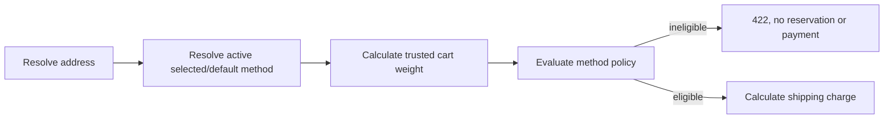

# Workshop 08e: Shipping eligibility is authorization, not pricing

This workshop repeats one distinction in several ways because it prevents expensive checkout bugs: **Can this carrier serve the package?** and **What does the carrier cost?** are separate questions.

## First explanation: a loading-dock gate

A truck reaches a loading dock. Before calculating its fee, the clerk checks whether it travels to the destination and whether it can carry the package. A cheap price does not give the truck permission to take an unsupported package.

`ShippingEligibilityRules` is that gate. It returns `CountryNotServed` and/or `WeightExceeded`. `ShippingMethod.CalculateCharge` runs only after the selected method passes the gate.

## Second explanation: validation versus calculation

The informational preview accepts a client-supplied weight because it helps build a picker. Checkout ignores that earlier answer and calculates weight from active cart lines. A browser can be stale or dishonest; server-owned catalog weights are the command's authority.

## Third explanation: three sources of truth

- The address supplies the normalized two-letter destination country.
- Active cart variants and quantities supply weight using checked `long` arithmetic.
- The selected method's current policy supplies allowed countries and the inclusive maximum.

No policy means unrestricted compatibility. An empty country list means any syntactically valid country. A null maximum means no configured weight limit. These defaults let old methods keep working after migration.

## Boundary example

Light permits US/CA and at most 2,000 grams:

| Input | Result | Reason |
|---|---|---|
| US, 2,000 g | eligible | maximum is inclusive |
| US, 2,001 g | rejected | `WeightExceeded` |
| GB, 500 g | rejected | `CountryNotServed` |
| GB, 2,001 g | rejected | both reasons |

Countries normalize with trim plus uppercase. `us` becomes `US`. This is syntax normalization, not postal-address verification.

## Why checkout never switches silently

If a shopper explicitly chooses Light and Light cannot serve the cart, returning another method would change delivery speed and price without consent. The same applies to an ineligible default. Checkout returns 422 and lets the client present alternatives.

## Policy replacement and races

A missing policy has null revision. Creation requires null and produces revision 0. Replacement requires the exact current revision. The short write transaction prevents two administrators from silently replacing the same policy.

Checkout reads the policy before inventory reservation, discount use, gift-card redemption, and gateway calls. Tests assert those counters and balances remain unchanged after rejection.

## Trace the code

1. `ShippingEligibilityPolicy` normalizes and bounds configuration.
2. `ShippingEligibilityRules.Evaluate` is pure and emits stable reason codes.
3. `ShippingEligibilityController` implements admin replacement and public preview.
4. `ShippingRulesService.EnsureEligibleAsync` applies the current policy to trusted checkout data.
5. `CheckoutPricingService` shares that path between quote and checkout.

## Exercises

1. A policy has no countries and maximum 0. Are US at 0 g and US at 1 g eligible?
2. Preview says Light is eligible at 100 g. The cart later weighs 2,500 g. Which value does checkout trust?
3. The default is ineligible but Express is eligible. Should the server silently choose Express?
4. Why use `long` and checked multiplication for weight?
5. Where must the eligibility check sit relative to stock reservation?

## Answers

1. Zero grams is eligible; one gram fails `WeightExceeded`. Empty countries means any country.
2. Checkout recomputes 2,500 g from active cart data and rejects Light.
3. No. Return 422 so the shopper explicitly selects a supported method and sees its price.
4. Many legal line weights multiplied by quantities can exceed a 32-bit total. Checked arithmetic turns corruption into a clear rejection.
5. Before reservation and every external or monetary effect.

## Journal prompts

- Name another place where a preview must be revalidated by a command.
- Which facts come from the client, catalog, and policy?
- What would break if missing policies meant “reject all” during rollout?
- Explain inclusive maximum weight without using the word “inclusive.”

You understand this story when you can say: preview informs the UI; checkout authorizes the actual package.
