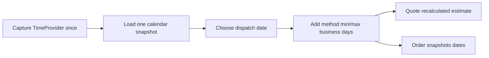

# Workshop 08f: Business-day calendars and captured promises

Adding 24 hours moves an instant. Advancing one business day applies a calendar rule. Those operations sometimes land on the same date, which is why the bug can hide until a weekend or closure.

## First explanation: mark a paper calendar

Use Friday 11 September 2026, a 14:00 UTC cutoff, and Monday closed.

- Friday 13:59 is before cutoff, so dispatch is Friday. Day 0 is Friday; day 1 is Tuesday.
- Friday 14:00 is not strictly before cutoff, so dispatch moves to Tuesday. Day 0 is Tuesday; day 1 is Wednesday.

The exact cutoff belongs to the later branch. Tests must include one minute before and the exact minute.

## Second explanation: three small functions

`IsBusinessDate(date)` answers whether the date is Monday-Friday and not closed.

`NextBusinessDate(date)` searches forward, excluding the input date.

`AddBusinessDays(date, n)` advances until it has counted `n` business dates. Zero returns the dispatch date.

Small pure functions make leap days, year boundaries, weekends, and consecutive closures testable without HTTP or a database.

## Third explanation: a captured checkout promise



The quote is informational and recalculated later. The paid order stores its result. Changing Christmas closures next week does not rewrite yesterday's delivery promise.

## Enabled and disabled semantics

Disabled mode preserves the old `now.AddDays` behavior, including time of day. That is a compatibility switch for existing installations.

Enabled mode returns date-only meanings serialized as midnight UTC. Midnight is a storage representation; it does not promise a parcel arrives at exactly midnight.

## Why UTC only in this slice

The cutoff is a minute from 00:00 through 23:59 UTC. There is no shop timezone or daylight-saving rule yet. This narrow contract is deterministic across developer laptops and production hosts. A future timezone story would need named-zone rules and explicit ambiguous-time behavior.

## Bounds are correctness tools

The configuration accepts at most 366 unique closure dates. Search functions stop after 730 calendar days. Without a guard, corrupt legacy data or an extreme method range could loop for an unreasonable time.

Shipping methods must satisfy `0 <= MinDays <= MaxDays`. Calendar configuration cannot repair a malformed method, so calculation rejects it clearly.

## Revision sequence

The singleton row is seeded disabled at revision 0. Admin replacement supplies the exact revision:

```text
revision 0 + expected 0 -> revision 1
revision 1 + expected 0 -> 409 Conflict
```

Closure dates are replaced as one set and sorted in responses. Duplicate dates are rejected rather than silently collapsed because duplicates usually reveal a client or operator mistake.

## Trace the code

1. `DeliveryCalendar` owns enabled state, cutoff minute, revision, and closures.
2. `DeliveryDateCalculator` contains deterministic date arithmetic.
3. `DeliveryCalendarController` replaces the singleton with optimistic concurrency.
4. `ShippingRulesService.DeliveryDatesAsync` loads one snapshot.
5. Quote exposes recalculated dates; checkout copies those exact dates onto the order.

## Exercises

1. Friday is before cutoff and Monday is closed. What are day 0, day 1, and day 2?
2. Repeat at the exact cutoff.
3. Why does disabled mode retain the time of day while enabled mode uses midnight UTC?
4. An admin changes closures after an order is paid. Should the order response change?
5. What does a 730-day failure tell you?

## Answers

1. Friday, Tuesday, Wednesday.
2. Dispatch moves to Tuesday, so day 0 Tuesday, day 1 Wednesday, day 2 Thursday.
3. Disabled preserves legacy elapsed-day behavior. Enabled represents business dates, so a canonical UTC midnight carries the date without host-local conversion.
4. No. The order is a captured historical promise; only a new quote uses new configuration.
5. Configuration or legacy method data cannot produce a reasonable estimate within the supported bound, so calculation stops explicitly.

## Debugging checklist

- Was `TimeProvider` captured once?
- Was UTC used before deriving date and cutoff minute?
- Is “before cutoff” strict?
- Does day zero equal dispatch?
- Are weekends and closures both excluded?
- Are min and max calculated from the same dispatch date and snapshot?
- Does checkout persist the result instead of recalculating during reads?

## Journal prompts

- Explain the difference between an instant and a business date.
- Which boundary test would have caught `<= cutoff` instead of `< cutoff`?
- Why is preserving disabled behavior a rollout feature?
- How would adding a named shop timezone change the design?

You understand this story when you can calculate the Friday example on paper and explain why old orders never consult today's calendar.
