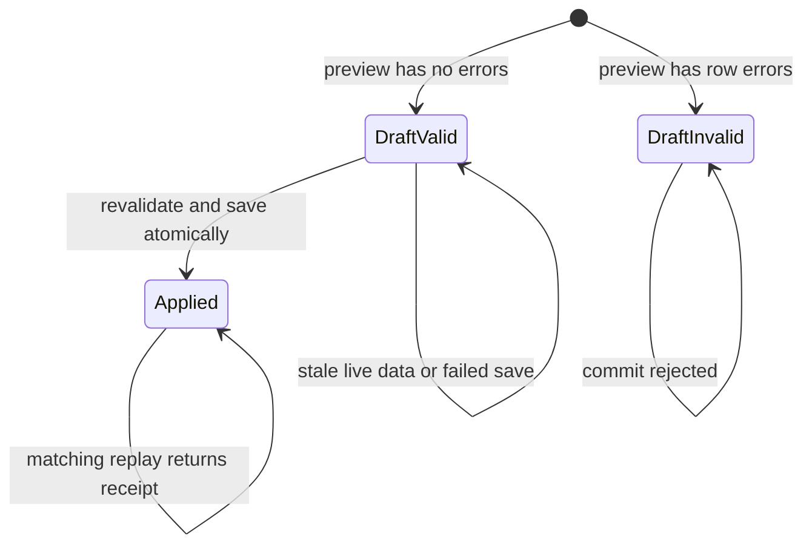

# Workshop 8g: a preview is not a reservation

Story: **SS-01, catalog import preview and commit**. Read this once for the story, again with the files open, and a third time while running the failure examples. The purpose is to learn how to keep a batch understandable when the world changes between two requests.

## First pass: a shopping-list analogy

Writing a shopping list does not reserve the shop's last carton of milk. A preview is similarly a description of what an administrator would like to create. It checks whether that description works **now**. Commit checks again and creates the products together.

The database stores the proposal so the administrator can return to it. It also stores a digest: a deterministic fingerprint of the normalized proposal. The digest answers “is this the proposal I reviewed?” It does not answer “is this proposal still possible?”

There are therefore three separate questions:

1. Is the submitted document structurally acceptable?
2. Does every row fit the current catalog and category rules?
3. Has this particular import already been applied?

Each question belongs to a different part of the implementation. Confusing them produces bugs such as trusting an old preview or creating a second batch after a network retry.

## Second pass: walk through two rows

Imagine a catalog with no products named `travel-mug` or `tea-tin`.

| Moment | Row A | Row B | Durable result |
| --- | --- | --- | --- |
| Preview | `travel-mug` is available | `tea-tin` is available | One DraftValid import; no products |
| Another administrator acts | Still available | Creates `tea-tin` | That administrator's product |
| Commit | Still available | Slug now conflicts | 409 with row errors; neither import row created |

The tempting implementation saves A as soon as A passes. That would leave half an import when B fails. This implementation constructs detached product graphs, collects every validation error, and only attaches graphs after **all** rows pass.

Now imagine a clean commit succeeds, but the HTTP response is lost. The client sends the same import ID and digest again. The stored Applied state and receipt return the original product IDs. The service does not create more products or inventory rows.

Notice the identity: replaying import X differs from previewing the same JSON again as import Y. Y is a different request whose live identifiers will conflict with X's products.

## Third pass: trace the code

Open these files in order:

1. [CatalogImportContracts](../../src/Agora.Api/Contracts/CatalogImportContracts.cs) defines version 1, 1–100 rows, at most 300 variants, and commit revision/digest fields.
2. [CatalogImportBodyLimitAttribute](../../src/Agora.Api/Filters/CatalogImportBodyLimitAttribute.cs) stops reading after 1 MiB plus one sentinel byte. It also checks requests without a Content-Length header.
3. [ProductDraftMapping](../../src/Agora.Api/Contracts/ProductDraftMapping.cs) trims the documented identifiers, normalizes currency/tax code, and orders option dictionary keys. It forces imported products inactive.
4. [ProductDraftService](../../src/Agora.Infrastructure/Services/ProductDraftService.cs) checks category, slug, SKU, tax category, and category option schema, then constructs a zero-stock product graph. The existing single-product create route uses this service too.
5. [CatalogImportService](../../src/Agora.Infrastructure/Services/CatalogImportService.cs) owns preview, commit, digest, row errors, and transaction boundaries.
6. [CatalogImport](../../src/Agora.Domain/Entities/CatalogImport.cs) owns the state transition and revision. Its result rows preserve historical product identifiers.
7. [CatalogImportConfiguration](../../src/Agora.Infrastructure/Persistence/CatalogImportConfiguration.cs) maps the revision token and unique row/position constraints.

For each file, write one sentence beginning “This file is responsible for…”. If two sentences describe the same responsibility, inspect whether that is deliberate reuse or accidental duplication.

## The state machine



A failed commit does not secretly replace the reviewed proposal. Its response contains current row errors. The administrator creates a new preview after correcting the problem. The original draft remains historical evidence of what was reviewed.

An expired **draft** cannot be committed. An Applied import can still return its receipt after its old draft expiry. That ordering matters: expiry limits permission to perform new work, while a receipt describes work already done.

## Read the transaction as a sentence

“Inside one local write transaction, load the import, check its digest, replay Applied if appropriate, validate draft state/revision/expiry, revalidate every row, insert every product graph, insert every receipt row, mark Applied, save, and commit.”

Read it again with failure points inserted:

- Wrong digest: no graph is attached.
- Expired draft: no graph is attached.
- Row B's category vanished: no graph is attached.
- Receipt insert fails: product, inventory, receipt, and state changes roll back together.
- Competing draft wins a unique identifier: the losing request returns a conflict without partial products.

The database transaction supplies atomicity. The revision and unique indexes supply additional checks. A green validation function alone does not supply either guarantee.

## Normalization is part of the contract

Product and variant names and SKUs are trimmed as in single-product creation. Missing slug is derived from the product name. Currency is uppercase; tax code is lowercase. Option keys are sorted for deterministic serialization, while their values remain author-provided. Category schemas perform their own option normalization and validation.

Product rows and image arrays retain input order. Order can be meaningful to the reviewer and receipt, so “sort everything” would be a poor normalization rule. Duplicate row keys are compared ordinally after trimming; duplicate batch SKUs ignore case. Existing catalog SKU checks preserve the current single-product database comparison.

Imported products are always inactive, including when an input row says `isActive: true`. Inventory starts at zero. Import does not update an existing product and does not import stock. The normalized GET response makes that result visible before commit.

The import digest is a fingerprint, not a password, signature, or authorization token. These endpoints still require an administrator session.

## A request you can adapt

Replace `CATEGORY_ID` with an existing category ID:

```json
{
  "version": 1,
  "products": [{
    "rowKey": "A",
    "product": {
      "categoryId": "CATEGORY_ID",
      "name": "Travel mug",
      "slug": "travel-mug",
      "description": "Workshop example",
      "isActive": false,
      "variants": [{ "sku": "MUG-ONE", "name": "Default", "price": 12.50, "currency": "USD", "options": {}, "weightGrams": 250 }],
      "images": []
    }
  }]
}
```

POST to `/api/admin/catalog-imports/preview`. Read the returned normalized products, errors, digest, revision, and expiry. Then POST `{ "revision": 0, "digest": "THE_RETURNED_DIGEST" }` to `/api/admin/catalog-imports/IMPORT_ID/commit`. The server returns actual values; do not guess the digest.

## Verification and what it proves

[CatalogImportApiTests](../../tests/Agora.Tests/Integration/CatalogImportApiTests.cs) exercises clean preview/commit/replay, expired Applied replay, taken slug, removed category, batch duplicates, enforced option rules, authorization, version/revision, and payload bounds.

[CatalogImportPersistenceTests](../../tests/Agora.Tests/Integration/CatalogImportPersistenceTests.cs) uses independent SQLite connections for competing drafts. A trigger deliberately aborts receipt insertion and fresh reads check that products and stock did not survive. An upgrade test preserves the old catalog and adds empty staging tables.

These tests are written as executable evidence; consult [the journal](journal.md) for the latest actual run and failures. Do not treat the presence of a test file as proof it passed. SQLite concurrency behavior is the target being exercised; this is not a claim about every database engine.

## Exercises: predict before running

1. A draft is valid at 10:00. Its category is deleted at 10:01. What should commit at 10:02 do?
2. Commit succeeds, but the client never receives the response. What identity must the client retain?
3. An Applied import's expiry was yesterday. Should a matching replay fail?
4. Which records should remain after a forced receipt insertion failure?
5. Two separate drafts contain the same two slugs. Can both apply successfully?
6. Delete an imported product after commit. Should the historical receipt disappear?

### Worked answers

1. Return live row errors and create no products. Preview did not reserve the category.
2. The import ID, reviewed digest, and original revision. Retrying that import returns its receipt; creating a new preview is different work.
3. No. Replay is checked before draft expiry. A different digest still fails.
4. The previously saved draft remains DraftValid at its original revision. No new product, inventory, or receipt rows remain.
5. No. The serialized local transaction and database uniqueness rules permit one complete winning batch; the other sees conflicts.
6. No. Receipt product IDs are historical identifiers with no product lifetime foreign key. A receipt proves creation, not continued product existence.

## Journal prompts and a second explanation

Write the two-row conflict in your own words without using “atomic” or “idempotent.” Then explain it again using those words correctly. Draw the boundary around all writes that must succeed together. Finally, name a fact the preview checks that can become false before commit.

There is no automatic draft cleanup in this slice. A later retention feature needs an explicit policy for invalid drafts, valid drafts, and applied receipts. Keeping those distinctions visible is part of learning to maintain operational history.
