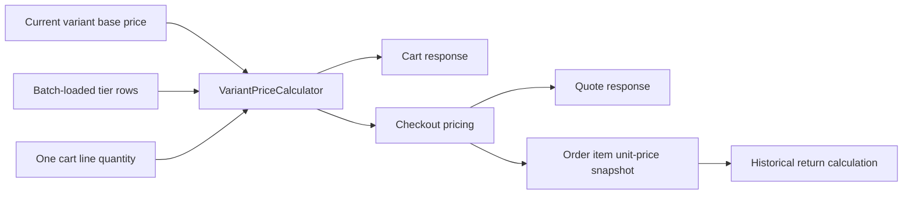

# Workshop 8h: one price calculator, many workflows

Story: **SS-04, quantity price tiers**. This workshop connects a small pure function to a cart, a quote, payment, and a historical refund. Work through the arithmetic before opening the controller.

## First explanation: the price label has a condition

A variant has a base price of 10 USD. Its policy says “buy at least five for 9 each; buy at least ten for 8 each.” The condition belongs to **one variant line**. Three black shirts and two white shirts do not become five black shirts.

| Quantity on one line | Highest qualifying threshold | Applied unit price | Line total |
| --- | --- | --- | --- |
| 4 | None | 10 | 40 |
| 5 | 5 | 9 | 45 |
| 9 | 5 | 9 | 81 |
| 10 | 10 | 8 | 80 |

It is possible for ten units to cost less than nine. That follows from the configured all-units volume price: the selected unit amount applies to every unit on that line. This feature is not marginal pricing where only the tenth unit gets the final discount.

Read the table aloud. Then close it and calculate quantities 1, 6, and 12. Answers: 10, 54, and 96.

## Second explanation: a decision followed by multiplication

The calculator makes two decisions:

1. Among tiers whose threshold is at most the quantity, choose the largest threshold.
2. Use the lower of that tier's amount and today's base price.

If there is no qualifying tier, use base price. Only then multiply by quantity.

Why the second decision? An administrator might reduce the base price from 10 to 7 after saving an 8-unit-price tier. A ten-unit customer must pay 7 each, not a quantity “discount” that increases the price to 8. The response can still identify the qualifying threshold, but the actual unit amount is capped by the current base.

## Third explanation: follow the value through the application



The critical arrow is the last one. A return reads the order snapshot. It never asks today's live tier table what yesterday's purchase cost.

Open [VariantPriceCalculator](../../src/Agora.Domain/Services/VariantPriceCalculator.cs). It has no database, clock, HTTP request, or payment gateway. You can give it inputs and calculate the answer by hand. This is what makes the rule easy to test independently.

Next open [VariantLinePricingService](../../src/Agora.Infrastructure/Services/VariantLinePricingService.cs). It gathers all variant IDs and loads tier rows in one query. It returns calculated prices keyed by cart-item ID. This is the bridge from persistence to the pure rule.

Finally open [CartResponseFactory](../../src/Agora.Api/Queries/CartResponseFactory.cs) and [CartContracts](../../src/Agora.Api/Contracts/CartContracts.cs). The factory performs asynchronous loading; the DTO mapper receives calculated values. The mapper itself has no hidden database access.

## Why a mapper refactor was necessary

Before this feature, many controllers called `CartResponse.From(cart)` directly. Changing only the main cart GET would leave wishlist copies, order reorders, cart merges, and template applications displaying different totals.

The runtime call-site audit now routes all these responses through the same factory. The static mapper retains a base-price fallback for callers explicitly mapping without a loaded policy, such as isolated response tests; production endpoints use the factory.

Repeat the lesson in a different form: a correct function does not fix an application until every relevant path reaches it. Search for the old multiplication and old mapping call sites whenever a cross-cutting rule changes.

## Saved lines and the currency trap

A saved item is visible but is not in the active purchase. It still shows its own base price, applied unit price, and selected threshold. It contributes zero to the active subtotal.

Consider a saved EUR line followed by an active USD line. The subtotal must use USD. Taking the currency from the first arbitrary cart item would incorrectly choose EUR and then fail when adding USD.

The mapper now selects subtotal currency from the active set. With no active items, it returns zero USD, the application's default currency. Saved lines retain their own labeled currencies. Active lines must share one currency; cart mutations reject a mixed active set before saving, and checkout's money arithmetic rejects it as well.

This is a useful recurring question: “Does this aggregate include all rows, or only the rows that participate in this operation?” You have already seen the same distinction in saved carts, fulfillment remaining quantities, and requested versus approved returns.

## The API policy contract

Admin GET/PUT `/api/admin/variants/VARIANT_ID/quantity-pricing` reads or fully replaces a policy. A first PUT supplies `expectedRevision: null`; a replacement supplies the exact returned revision.

```json
{
  "expectedRevision": null,
  "tiers": [
    { "minimumQuantity": 5, "unitAmount": 9.00 },
    { "minimumQuantity": 10, "unitAmount": 8.00 }
  ]
}
```

At most five tiers are allowed. Thresholds are distinct and increasing from 2 through 99. Amounts are whole cents, nonnegative, nonincreasing, and no larger than the live base price when saved. Zero is allowed. An empty list disables tier pricing while preserving the policy's revision history.

[VariantQuantityPricing](../../src/Agora.Domain/Entities/VariantQuantityPricing.cs) validates the entire replacement before mutating the old policy. Matching threshold children are updated in place; removed thresholds are deleted; new thresholds are added. This avoids tracking two different objects with the same database key during replacement.

The write transaction covers the live base-price read and policy save. The policy revision rejects a stale editor. The composite tier key enforces one row per variant/threshold even if application validation is accidentally bypassed.

## Coupon, tax, shipping, and gift-card order

Quantity pricing changes the base line subtotal. The existing later calculation order remains:

1. Applied unit price multiplied by each line's quantity.
2. Coupon discount calculated from that subtotal.
3. Tax calculated from discounted taxable line values.
4. Shipping calculated using the discounted subtotal and actual weight.
5. Gift-card contribution and remaining payment calculated from the total.

For ten items at 8, subtotal is 80. A 10% coupon gives an 8 discount. At 8% tax, 72 × 0.08 = 5.76 tax. Shipping and tender follow their existing rules.

The quote uses the same result. It is an estimate at its calculation time; checkout recalculates current inputs. A cart or quote is not a promise to freeze a price indefinitely.

## Historical return arithmetic

Buy ten at 8 each, with the 10% coupon and 8% tax above. Now change the live tier to 1 each. Return two units.

The return begins with the purchased unit price, 8. Two units are 16 before the historical discount/tax allocation. With those order rates: 16 × 0.9 × 1.08 = 15.552, rounded by the existing return rule to 15.55.

It does not begin with 1, and it does not refund shipping through this line calculation. Pricing policy is mutable configuration; an order item is historical evidence.

## Read and run the evidence

- [VariantPriceCalculatorTests](../../tests/Agora.Tests/Unit/VariantPriceCalculatorTests.cs): exact thresholds, base-price reduction, zero/empty tiers, and invalid replacement immutability.
- [QuantityPricingApiTests](../../tests/Agora.Tests/Integration/QuantityPricingApiTests.cs): cart/quote/checkout agreement, historic return, saved currencies, one tier query, policy revision, precision, and disable behavior.
- [QuantityPricingPersistenceTests](../../tests/Agora.Tests/Integration/QuantityPricingPersistenceTests.cs): old-price upgrade preservation, no invented policies, stale replacement rollback, and variant-owned cascade deletion.

Use [the journal](journal.md) to distinguish written tests from verified passing runs. A full cart and totals regression is necessary because this rule reaches several response paths.

## Exercises with answers

**1. Quantity falls from ten to four. What remains selected?** No tier. Four units use base price, so they total 40 at a base of 10.

**2. A saved five-unit EUR line precedes an active four-unit USD line. What is the subtotal?** 40 USD. The saved line shows 9 EUR per unit but contributes nothing.

**3. Base becomes 7 after an 8 tier was configured. What do ten units cost?** 70. The selected tier cannot become a surcharge.

**4. Two clients load revision 3. Both replace the policy. What should happen?** One may commit revision 4. The other must reload and reconsider; its stale revision cannot silently overwrite the winner.

**5. Why not query the tier table from every CartItemResponse constructor?** That hides I/O in mapping and creates a query per line. Loading once makes both the cost and the rule visible.

**6. A return follows a later policy edit. Which price wins?** The order's saved UnitPrice. Explain that answer using the difference between current configuration and historical facts.

## Journal exercise

Draw the same flow twice. In the first drawing, label every price source. In the second, label when each value can change. Circle the point where a live calculation becomes a historical snapshot. Then explain to a new teammate why reusing the calculator for returns would be a bug even though reusing it for cart and checkout is correct.
