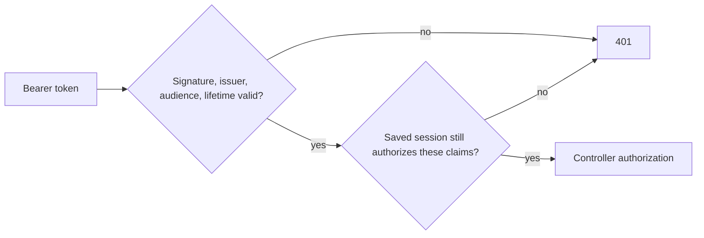

# 09a — Revocable login sessions

## The promise in ordinary language

A customer who loses a device can switch off that device's login before its token naturally expires.

Say it again in a different way: a bearer token is no longer an irrevocable one-hour key. The signature can remain mathematically correct while the server decides that the login represented by the token is no longer allowed.

One more version: JWT validation answers **“did our server issue this envelope, and is the envelope still within its date?”** Session validation answers **“do we still honor the login named inside that envelope?”** Both answers must be yes.

## First mental model: passport plus entry list

Imagine a signed passport. A border officer checks that its seal is genuine and that its expiry date has not passed. A separate entry list can still say that this particular passport is cancelled.

In Agora:

| Passport idea | Code idea |
| --- | --- |
| signed seal | HMAC JWT signature |
| holder number | `sub` customer claim |
| permission class | `role` claim |
| passport number | `sid` session claim |
| printed expiry | JWT `exp` claim |
| entry list | `LoginSession` table |

The analogy is imperfect. A JWT is a bearer credential: whoever possesses it can send it. That is why the database never stores the raw JWT. Storing it would turn a database read into credential theft.

## Second mental model: two locks in series

Every protected request passes through two locks:



The order matters. We do not query the database for garbage tokens. The framework performs the cryptographic checks first. Only its validated-token event performs the session lookup.

Repeat that as a rule: **crypto first, state second, controller third.**

## Trace one successful login

Suppose customer A logs in from a phone at 12:00. The configured lifetime is 60 minutes.

1. `AuthController.Login` checks the password.
2. `JwtTokenService.PrepareIssue` captures 12:00 once and calculates 13:00 once.
3. `AuthenticationSessionService.Start` creates session S1 with A, role `Customer`, 12:00, and 13:00.
4. EF saves S1.
5. `JwtTokenService.IssueToken` signs a token with `sub=A`, `role=Customer`, `sid=S1`, and `exp=13:00`.
6. The response returns the token, expiry, and S1's public identifier.

The save comes before token creation. If the save fails, the endpoint does not hand the caller an unusable token.

Registration follows the same idea. EF saves the new customer and its first session together. The relationship tells EF to insert the customer before its dependent session.

## What the central check proves

`AuthenticationSessionService.IsAuthorizedAsync` requires all of these facts:

| Check | Failure it blocks |
| --- | --- |
| session ID exists | invented or deleted `sid` |
| session customer equals `sub` | using A's session ID in B's token |
| customer still exists | deleted-account token |
| `RevokedAt` is null | lost-device token |
| session expiry is after server time | expired saved session |
| session expiry exactly equals JWT expiry | mixing claims from a different issue |
| saved issued role equals token role | altered or inconsistent issue |
| current customer role equals issued role | permissions changed since login |

“Exactly equals” is easier to understand with numbers. If the row says 13:00 and the token says 13:05, each expiry might independently be in the future, but they do not describe the same authorization decision. The request is rejected.

## Why time is rounded to a whole second

JWT time claims use Unix seconds. A database timestamp can preserve smaller fractions. If we saved `13:00:00.417` but the JWT encoded `13:00:00`, exact comparison would reject the token immediately.

The issuer therefore rounds the captured issue time to a Unix second before deriving both expiries. This is a boundary-design lesson: normalize once at the system boundary, then reuse the normalized value.

Authentication uses `AuthenticationTimeProvider`, separate from the business `TimeProvider`. Reporting and return-policy tests deliberately move business time by days or months; doing that must not accidentally expire every test login. Authentication tests can replace their dedicated clock when they need an exact expiry boundary.

Expiry is exclusive. At 12:59:59 the session may be active. At exactly 13:00:00 it is expired. The rule is `ExpiresAt > now`, not `>=`.

## Revoking one session

Customer A logs in twice:

```text
S1  Phone   active
S2  Laptop  active (current request)
```

S2 sends `DELETE /api/me/sessions/S1`. The server scopes the lookup by both S1 and customer A. It records server time in `RevokedAt` and returns 204.

The next request made with S1 passes signature validation but fails session validation, so it receives 401. S2 remains active.

Calling the same DELETE again is a successful no-op. Idempotence means the desired final state, “S1 is revoked,” is already true. The entity preserves the first revocation time rather than pretending a second revocation happened later.

If A asks to revoke B's session, the endpoint returns 404. It does not reveal whether B's private session identifier exists.

## Revoking every session

`POST /api/me/sessions/revoke-all` loads the caller's currently unrevoked saved sessions in one local transaction, captures one server time, marks every row, and saves once.

The request itself was authorized before the mutation. Its response can finish. The caller's next request fails. Revocation cannot travel backward in time and cancel controller work that already passed authorization.

A login that commits after revoke-all's transaction is a new session. It was not part of the saved set seen by that transaction. This is ordinary transaction ordering, not an exemption.

## Listing sessions safely

`GET /api/me/sessions` is owner-scoped and bounded. Page numbers start at one, page size is 1 through 100, and sorting is deterministic: newest issue time first, then ID.

Only unrevoked, unexpired sessions are “active.” `isCurrent` compares each row's ID with the request's validated `sid`. The response is marked `private, no-store` because device labels and login timing are account-private metadata.

No response contains a raw JWT. A session ID is an identifier, not a bearer token; possessing only S1 cannot authenticate a request because the attacker still lacks a valid signed token.

## Rollout and old tokens

Old tokens have no `sid`. There is no honest database row that can be reconstructed for them: the server did not retain an issue record or raw token history. After cutover, the validated-token hook rejects them and users log in again.

That temporary inconvenience is the cost of changing the authorization promise. Silently accepting missing `sid` would leave an unrevocable path and make the feature's promise false.

Deployment order matters:

1. apply the table migration;
2. deploy issuance with `sid` and central validation;
3. communicate that existing sessions require login again;
4. do not roll back to permissive stateless acceptance without an explicit coordinated rollback plan.

## Database cost and scope

Stateless JWT validation needed no application database read. Revocable sessions add one bounded indexed lookup to every authenticated request. The `(CustomerId, ExpiresAt)` index supports owner/active-session access, and the primary key supports validation by S1. The expiry index also supports a later retention job.

This story does not add refresh tokens, password-reset revocation, session renaming, location tracking, or automatic cleanup. Those require separate contracts and threat analysis.

## Read the implementation in three passes

### Pass 1: nouns

Read `LoginSession` and name its facts: who, what role was issued, optional device label, when issued, when expired, and whether revoked.

### Pass 2: verbs

Read `Start`, `IsAuthorizedAsync`, `Revoke`, and `RevokeAll`. For each verb, write down which rows it reads and which rows it changes.

### Pass 3: boundaries

Read `JwtTokenService`, then the JWT validated-token event in `Program.cs`. Locate the handoff from framework cryptography to application authorization. Finally trace one protected controller; it needs no session-specific code because the check is central.

## Worked failure table

| Situation | Signature valid? | Session check? | Result |
| --- | ---: | ---: | --- |
| normal S1 request | yes | passes | controller runs |
| S1 revoked | yes | fails | 401 |
| unknown/forged `sid` in a correctly signed test token | yes | fails | 401 |
| old token without `sid` | yes | cannot start | 401 |
| A token names B session | yes | relationship fails | 401 |
| A promoted after token issue | yes | current role differs | 401 |
| A deleted | yes | join finds no customer | 401 |
| JWT expired | no | not reached | 401 |

## Tests as evidence

The focused tests prove several different claims:

- entity tests prove label normalization, exclusive expiry, and idempotent revocation;
- the two-login test proves ownership listing, `isCurrent`, one-session revocation, and rejection on another protected route;
- revoke-all proves that the current session is included and fails on its next request;
- cross-customer deletion proves privacy through 404;
- database mutations prove exact-expiry mismatch, role staleness, and customer removal are centrally rejected;
- paging and anonymous tests prove the read boundary.

An HTTP 204 alone does not prove revocation. The important assertion is the following request with the still-cryptographically-valid token returning 401.

## Exercises

1. S1 expires at 14:00. The server time is exactly 14:00. Should it pass?
2. A changes from Customer to Admin. Why reject the old Customer token instead of merely allowing fewer permissions?
3. Why does the login endpoint save before signing?
4. Why is another customer's session 404 rather than 403?
5. Why can revoke-all return 200 even though the same token fails afterward?
6. Where should the session check live if every protected route must obey it?
7. Does deleting an expired session change whether its old JWT is cryptographically valid?
8. What race does “a login that commits afterward is new” describe?

## Answers

1. No. Expiry is an exclusive boundary: the saved expiry must be greater than now.
2. Exact role matching gives one simple invariant for every role change. The user must reauthenticate under the current account state, avoiding asymmetric promotion/demotion rules.
3. It prevents returning a credential with no durable authorization record when persistence fails.
4. A 404 does not disclose whether the private identifier belongs to someone else.
5. Authorization happened before the controller executed. The mutation affects later authorization checks, not work already running.
6. In the JWT validated-token event, after standard token validation and before controller authorization.
7. No. Cryptographic validity and current authorization are different questions.
8. Revoke-all and login serialize through database transactions. Whichever commits later defines the later state; revoke-all only revokes the set it actually locked and loaded.

## Explain it back

Try three versions, because being able to restate an idea is stronger than memorizing a phrase:

1. Explain revocable JWTs to a customer using the lost-phone example.
2. Explain them to a junior engineer using the two-lock diagram.
3. Explain them to a reviewer by naming every claim-to-row consistency check.

If you can explain why a valid signature can still yield 401, why expiry is compared exactly, and why the hook is central, you understand the heart of this feature.

## Journal prompts

- Which security guarantee comes from cryptography, and which comes from mutable database state?
- What did the framework already validate before our service runs?
- Which test most changed your confidence, and what specific false implementation would it catch?
- What operational cost did we add to authenticated requests?
- If the session table were temporarily unavailable, should authentication fail open or fail closed? Explain the promise you would be making.
