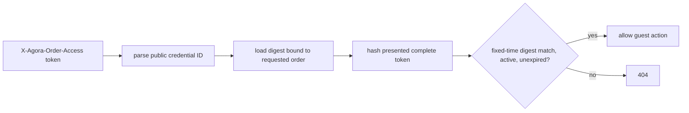

# 09b — Guest order access capabilities

## The customer promise

A guest can keep one private order credential and use it to see that order or manage its return. Knowing an order number or email address is no longer enough.

Repeat it another way: the order number identifies the resource; the guest token authorizes limited actions on that resource.

And once more: email is contact data. It is not proof of identity.

## The house-key model

An account login resembles a named building badge. A guest-order credential resembles a high-entropy key for one room. The key does not reveal the guest's identity and does not open neighboring rooms.

This is called a capability: possession of an unpredictable value grants a narrowly defined ability over a particular resource.



The header is `X-Agora-Order-Access`. The token never belongs in a URL. URLs appear in browser history, proxy logs, analytics, screenshots, and referrer headers.

## Token anatomy

The disclosed token has two pieces:

```text
32-hex-character-public-id.43-base64url-character-random-secret
```

The random secret contains 32 cryptographically random bytes: 256 bits. `RandomNumberGenerator` supplies it. The code does not use timestamps, ordinary GUID randomness alone, customer email, or a predictable counter as the secret.

The public ID permits one indexed lookup. It is not sufficient to authorize access. After lookup, the server hashes the complete supplied token with SHA-256 and compares that digest with the stored digest using `CryptographicOperations.FixedTimeEquals`.

The database stores:

- credential ID;
- bound order ID;
- SHA-256 digest;
- issue and exact expiry times;
- optional revocation time and admin audit IDs.

It never stores plaintext. A database reader cannot copy a usable guest bearer token.

## Why bind the digest to an order lookup

Suppose guest orders A and B have tokens TA and TB. Sending TA while requesting B must fail even though TA is a real, active token.

The query requires both credential ID and B's order ID. The digest comparison then proves the secret. Resource binding is part of authorization, not a controller convention.

Say the invariant aloud: **right secret, right order, right time, not revoked.**

## The complete access matrix

| Action | Account owner | Admin | Correct guest token | Email/order number only |
| --- | ---: | ---: | ---: | ---: |
| read order | yes | yes | guest order only | no |
| read fulfillments | yes | yes | guest order only | no |
| cancel order | yes | yes | no | no |
| full refund | no | yes | no | no |
| create return | yes | yes | yes | no |
| read return | yes | yes | yes | no |
| cancel requested return | yes | yes | yes | no |
| approve/reject return | no | yes | no | no |
| rotate guest credential | no | yes | no | no |

An account-owned order ignores a guest token. Matching its contact email also grants nothing. Its actual `CustomerId` must equal the authenticated `sub`, or the caller must be Admin.

## Why every old route must change

Adding a secure `/guest/orders/A` endpoint accomplishes nothing if `/orders/A` still returns the same order publicly. Attackers choose the weakest route.

The route audit therefore includes order read, fulfillment read, order cancellation, full refund, return create, return read, return cancel, approve, and reject. The central evaluator handles owner/admin/capability decisions, while route-level role checks reserve financial and operational actions.

This is a recurring security lesson: enumerate assets and actions before coding. A secure new door does not repair an unlocked old door.

## Issuing at checkout

Only a checkout whose resulting `Order.CustomerId` is null receives a guest credential. The service creates the digest before checkout's final successful local save. Paid state, committed inventory, and the digest persist together. The controller reveals plaintext once in the checkout receipt.

Account checkout returns no guest token. Quote never creates one. A declined payment creates none. Webhook payloads use the existing order projection and never receive the issuance result.

There is a real system boundary here: the payment gateway call happens before the final local save. The repository already documents recovery limits for a post-payment database failure. Guest credentials do not pretend to solve that separate problem.

## One-time disclosure

“One-time” means the server returns plaintext only in the successful checkout or rotation response. Normal order reads return no credential. Database reads cannot reconstruct it from SHA-256.

If a client loses the checkout response, email matching is not an escape hatch. An admin can rotate or issue a credential after an appropriate support process. Email delivery and identity-proofing for that support process are outside this story.

## Rotation

Admin rotation runs in one local transaction:

1. load the requested order;
2. reject account-owned orders;
3. revoke every currently active credential at one captured time;
4. generate a new random secret and digest;
5. save revocation and replacement together;
6. reveal the new token once.

The filtered unique index allows one unrevoked credential per order. Revoked rows remain as audit facts. After rotation, TA fails and TA2 succeeds.

Legacy guest orders have no credential because plaintext history cannot be reconstructed. Rotation is the explicit admin-assisted bridge for them.

## Exact expiry

Credentials expire 30 days after issue. Expiry is exclusive:

```text
now < ExpiresAt   active
now = ExpiresAt   expired
now > ExpiresAt   expired
```

Expiry and revocation are separate. Expiry is automatic time-based invalidity. Revocation is an explicit audit event. A later cleanup job could remove old rows, but this story preserves them.

## Privacy-preserving failures

Wrong owner, missing token, malformed token, foreign token, expired token, revoked token, and unknown resource all appear as 404 on resource reads. That keeps the response from becoming an order-number or credential-ID oracle.

Malformed input is rejected before hashing or broad database work. The parser caps length, requires exactly one separator, checks the public ID shape, and checks the 43-character secret representation.

## Safe projections

Capability readers receive `CustomerOrderResponse`, which excludes:

- gift-card bearer code;
- payment transaction identifier;
- contact email;
- internal support notes and unrelated account data.

Customer return responses similarly omit the refund transaction ID. Admin queues may retain operational fields needed for administration. An entity graph is not an API contract.

## Trace a return

Guest A sends TA in the header while creating a return for order A.

1. The controller parses the requested reason and line shapes.
2. It creates a trusted actor input from authenticated identity/role plus the header.
3. `ReturnService` loads the actual order inside its write transaction.
4. The central evaluator verifies TA against that loaded order.
5. Existing eligibility and quantity rules run.
6. The return is saved with no fake customer identity.

The old request `Email` field may remain temporarily for wire compatibility, but it is ignored for authorization. This lets clients migrate without preserving the vulnerability.

## Tests as different kinds of evidence

Entity tests prove exclusive expiry and immutable first-revocation audit data. Persistence tests prove digest-only storage, foreign-order rejection, exact expiry, rotation, and account ownership rules.

HTTP matrix tests must prove more:

- order number and email alone fail;
- TA reads A but not B;
- TA creates, reads, and cancels A's return;
- TA cannot cancel/refund A or approve its return;
- an account owner and admin retain intended access;
- a matching-email stranger cannot read an account order;
- rotation invalidates TA and reveals TA2 once;
- ordinary reads, logs, and webhooks never contain the plaintext token.

Checking only the new guest endpoint would miss old-route bypasses. Each legacy route belongs in the regression matrix.

## Three review passes

### Pass one: identify

Underline every value that identifies something: order number, credential ID, return number, customer ID. Identification alone grants no rights.

### Pass two: authorize

For each route, point to the exact owner/admin/capability decision. If authorization happens only before loading the resource, ask whether the loaded order is rechecked.

### Pass three: disclose

List every response and log sink that could receive plaintext. The intended list has exactly two response cases: checkout issue and admin rotation.

## Exercises

1. Why is an order number unsuitable as a guest secret?
2. Why store a public lookup ID if it is not authorization?
3. Why hash the complete `id.secret` string instead of storing the secret?
4. TA is valid for A. What happens when it is sent for B?
5. A guest knows the account order's email and has a valid token for another guest order. Can they read it?
6. Why can TA cancel a return but not perform a full order refund?
7. Why does rotation retain the old row?
8. Why is returning the token in every GET incompatible with digest-only storage?
9. Why use a header rather than a query parameter?
10. What does a 404 protect beyond the order itself?

## Answers

1. It is displayed, shared, and comparatively guessable; it identifies rather than proves possession of a secret.
2. It gives an efficient indexed candidate lookup before the fixed-time digest comparison.
3. A database leak should not directly yield usable bearer capabilities.
4. The order binding fails and the response is 404.
5. No. Account orders require the real authenticated owner or an admin.
6. The capability's authority is deliberately narrow; refunds are privileged financial operations.
7. It preserves issue/revocation audit facts while the partial unique index permits one new active row.
8. The server cannot reconstruct plaintext from SHA-256, and repeated disclosure expands leak opportunities.
9. Query strings leak through common URL recording channels.
10. It avoids confirming whether a private order, return, or foreign credential identifier exists.

## Explain it back three ways

Explain the feature to a shopper as a private order key. Explain it to a junior engineer as a resource-bound random secret whose digest is stored. Explain it to a reviewer by walking every row of the access matrix and every plaintext disclosure point.

## Journal prompts

- Which old endpoint surprised you most during the route audit?
- Where does this design separate identity from capability possession?
- Which assertion proves email stopped being authorization?
- What could still leak the header if future HTTP logging settings change?
- How would you support a lost receipt without quietly restoring the email bypass?
- Which part is a local transaction guarantee, and which payment-recovery risk remains outside it?
