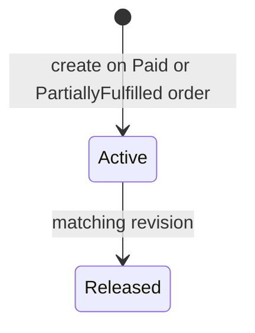

# Workshop 09c: Operational holds at the write boundary

An order hold means “do not create another shipment.” It does not cancel payment, restock units, change `Order.Status`, or erase a fulfillment that already committed.

## Three readings of the same rule

For support: a hold pauses future warehouse work while an address, stock, or customer question is investigated.

For an API client: create and release holds through admin routes; display history, but treat only `IsActive` as blocking.

For the database writer: the active-hold query and fulfillment insert belong to one serialized local transaction. A queue badge is useful information, but it is not enforcement.

Released rows remain history. A filtered unique index on `OrderId WHERE IsActive = 1` permits many historical rows but at most one active row.

## The race that defines correctness

Hold and fulfillment can arrive together. If fulfillment commits first, the shipment is valid and the later hold blocks the next one. If hold commits first, fulfillment returns 409. The forbidden result is both operations reading “no conflict” and then both committing as if they won.

That is why `FulfillmentService` must begin its short transaction before reading coverage and holds, save the fulfillment and order state inside it, then commit before sending a webhook. External calls must not keep SQLite's writer lock open.

## Code tour

1. `OrderHold` owns reason, internal note, actor/time, active state, and revision.
2. `OrderHoldConfiguration` maps the concurrency token and filtered unique active slot.
3. `OrderHoldService` validates order status and active uniqueness inside a transaction.
4. `WarehouseCoordinationController` keeps these internal details under admin routes.
5. `FulfillmentService` is the command-side guard. Every UI can be bypassed; this guard cannot.

Reasons are `AddressQuestion`, `StockInvestigation`, and `CustomerRequest`. Notes are plain text, trimmed, and at most 500 characters. Public order DTOs never contain either field.

## Worked example

An order has five units and two are already fulfilled. Create an address hold. A request for the remaining three fails without adding coverage or touching stock. Release revision 0; the hold becomes inactive at revision 1. A later fulfillment may ship three.

Notice the hold did not undo the earlier two. It controls the future boundary.

## Exercises

1. Why is changing `Order.Status` to `Held` risky?
2. Why does a list endpoint not enforce a hold?
3. What should happen if the same hold is released twice?
4. Draw both valid outcomes of a hold-versus-fulfillment race.

## Answers

1. It overloads financial/fulfillment lifecycle meaning and can accidentally rewrite cancellation/refund rules.
2. Another request can commit after the list read; enforcement must share the fulfillment transaction.
3. The second release is a 409 because the history is already terminal, not a new action.
4. Fulfillment-first leaves that shipment valid; hold-first rejects shipment creation.

Journal: explain “write boundary” without using the word transaction. Then explain it again using the exact reads and writes. List which existing cancellation and refund behaviors remain unchanged.
