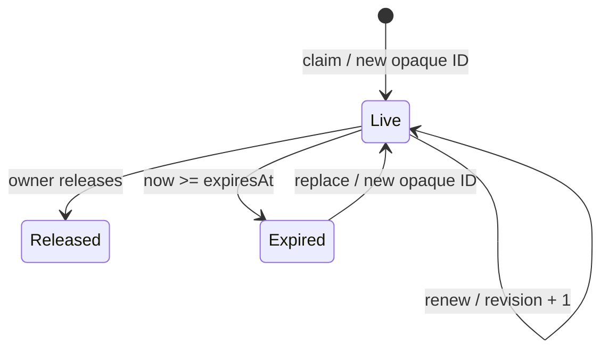

# Workshop 09d: Warehouse assignments as leases

A work assignment is temporary coordination, not stock reservation and not permanent ownership. It says which admin may create a fulfillment during a 15-minute window.

## Why three identifiers matter

`ExpiresAt` ends authority automatically. `Revision` detects edits to the current lease. `AssignmentId` identifies one generation of work. A new claim after expiry gets a new opaque ID even when the same person claims again, so a delayed request from an older session cannot regain authority by matching owner ID.

Expiry is inclusive: a claim at 10:00 is live at 10:14:59.999, and expired at exactly 10:15. Always capture `TimeProvider.GetUtcNow()` once per command.

## Authority table

| Stored state | Fulfillment input | Result |
|---|---|---|
| no assignment | no ID | legacy admin flow allowed |
| live assignment | matching owner and ID | allowed |
| live assignment | absent/wrong owner/wrong ID | 409 |
| expired assignment | old ID | 409 |
| expired assignment | new claim | replace slot, new ID |

Claiming does not deduct inventory. Expiring does not add inventory. A partial fulfillment leaves the lease available; a full fulfillment removes the matching slot in the same local save.

## Code tour

`WarehouseAssignment` owns the inclusive time predicate and authorization tuple. `WarehouseAssignmentService` serializes claim, renew, and release. The table uses `OrderId` as one durable slot and a unique `AssignmentId` for the generation. `FulfillmentService` accepts authenticated actor plus optional assignment ID and checks them with holds and coverage in one transaction.

The actor always comes from signed authentication claims. A request body may carry the opaque assignment ID, but never a trusted owner ID.

## Worked example

Admin A claims at 10:00: ID X, revision 1, expiry 10:15. B receives 409 at 10:14:59. At 10:15 B claims: ID Y, revision 2. A cannot renew or fulfill with X. Even if A later becomes owner again, X never becomes valid.

## Exercises

1. Why is owner ID alone insufficient?
2. Why check the assignment in the fulfillment transaction?
3. What changes when a lease expires by passage of time?
4. Why does full fulfillment clear the slot but partial fulfillment keep it?

## Answers

1. The same owner can have multiple generations; delayed requests need generation identity.
2. Otherwise claim/replacement can race after authorization but before fulfillment commits.
3. No background write is required. The next command evaluates `now >= ExpiresAt`.
4. Partial work can continue under the lease; a fully covered order has no remaining packing work.

Journal: explain a lease with a library-book analogy, then explain where that analogy breaks. Write boundary tests for one tick before expiry, exact expiry, wrong owner, stale revision, and an old assignment ID after replacement.
