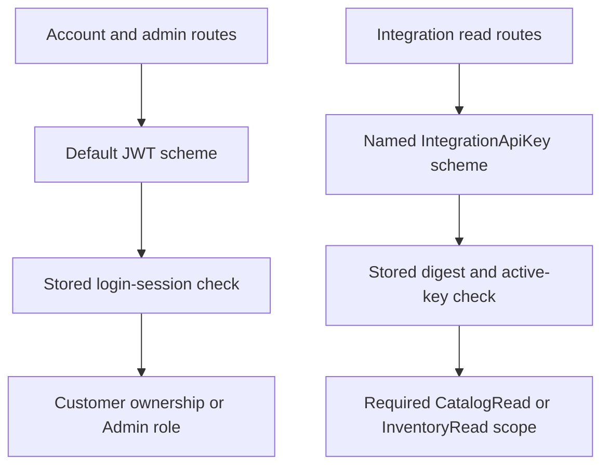

# Workshop 9e: read-only machine credentials

Story: **SS-12, scoped integration API keys**. Read this after the session and guest-order workshops. All three features use credentials, but their permissions are deliberately different.

## First pass: three different keys

Think of an employee badge, a parcel pickup code, and a meter-reading key.

- A login session identifies a customer or administrator and can be revoked.
- A guest-order credential grants a limited set of actions on one particular order.
- An integration key grants explicitly named machine read scopes on two integration endpoints.

Possessing one does not imply possessing the others. A catalog synchronization job does not become an administrator merely because an administrator created its key.

## Second pass: two independent authentication paths



The default authentication scheme remains JWT. The new endpoints explicitly select the named key scheme. Even a valid administrator JWT by itself cannot authenticate to those key-only endpoints. This prevents permissions from being combined accidentally.

The machine principal has an integration-key ID and scope claims. It has no customer subject and no Admin role. Search the handler for the claims it creates; absence is part of the design.

## The route matrix to predict

| Credential | Integration catalog | Integration inventory | Create product | Issue another key |
| --- | --- | --- | --- | --- |
| CatalogRead key | Allowed | 403 | 401 | 401 |
| InventoryRead key | 403 | Allowed | 401 | 401 |
| Both scopes | Allowed | Allowed | 401 | 401 |
| Administrator JWT alone | 401 | 401 | Allowed | Allowed |
| Malformed, revoked, or expired key | 401 | 401 | No key-based access | No key-based access |

The public catalog still works anonymously. Keeping it public does not grant the integration key additional authority. Likewise, merely sending a key header to a public checkout route does not authenticate it as a machine checkout identity; the header has no such permission meaning there.

**401** means the endpoint did not receive an accepted authenticated credential. **403** means this scheme authenticated the key, but the requested scope is missing. The difference helps diagnose configuration without revealing the secret or the stored digest.

## Third pass: trace issuance and use

1. [IntegrationKeysController](../../src/Agora.Api/Controllers/IntegrationKeysController.cs) requires Admin through the normal JWT path.
2. [IntegrationKeyService](../../src/Agora.Infrastructure/Services/IntegrationKeyService.cs) generates 32 random bytes using the platform cryptographic random generator.
3. The returned token combines a public GUID lookup ID, a dot, and a base64url secret.
4. The database stores a SHA-256 digest of that full token and metadata. It does not store the raw token.
5. [IntegrationKeyAuthenticationHandler](../../src/Agora.Api/Auth/IntegrationKeyAuthenticationHandler.cs) reads only `X-Agora-Api-Key`, validates its shape, and looks up the public ID.
6. The service checks expiry/revocation and compares digests with `CryptographicOperations.FixedTimeEquals`.
7. [IntegrationReadsController](../../src/Agora.Api/Controllers/IntegrationReadsController.cs) requires the exact scope and projects a bounded page of safe fields.

Read those steps again while following the files. Then explain why knowing the GUID in a listed key does not reveal the random secret.

## Why hashing works here

The generated secret contains 256 random bits. It is not a memorable human password. A digest can therefore verify possession without keeping recoverable plaintext. This does not mean password hashing should be replaced by fast SHA-256; the entropy and threat models are different. The application continues using its existing password hasher for human passwords.

The public ID makes lookup efficient. The constant-time comparison avoids ordinary early-exit byte comparison for the stored secret digest. Neither fact creates permissions; authorization still checks scopes after authentication succeeds.

The digest must also stay out of list responses and logs. It is not useful operational metadata for a client. The list projection selects only ID, name, scopes, expiry, and revocation timestamp.

## Issue, list, revoke, rotate

Admin POST `/api/admin/integration-keys`:

```json
{
  "name": "Warehouse read job",
  "expiryDays": 30,
  "scopes": ["CatalogRead", "InventoryRead"]
}
```

The response contains `key` metadata and one-time `apiKey`. Copy the token into the caller's credential storage at creation. This repository does not provide a secret-manager integration. Do not put the token in a URL, source file, journal entry, screenshot, or support message.

Admin GET `/api/admin/integration-keys?page=1&pageSize=20` lists metadata, including revoked keys. Page size is at most 100. Admin POST `/{id}/revoke` revokes a key; repeating revocation preserves the original revocation timestamp.

Rotation uses two distinct keys: create a replacement, configure the caller to use it, then revoke the old key. No endpoint reconstructs a lost secret. If the create response is lost, revoke that key by its metadata and create another.

Name is trimmed to 1–80 characters. Expiry is 1–90 days. Scopes are case-insensitive named input, normalized to `CatalogRead` and/or `InventoryRead`; unknown, empty, numeric, comma-combined, or duplicate-normalized scopes are rejected.

## Read contracts and bounded cost

GET `/api/integrations/catalog` returns one row per variant of an active product, ordered by SKU then variant ID. It exposes product/variant/category IDs, product name/slug, SKU, variant name, base unit amount/currency, and weight. Quantity tiers do not turn the catalog base price into an arbitrary cart price.

GET `/api/integrations/inventory` returns one row per variant with inventory, including inactive catalog products. It exposes variant ID, SKU, on-hand, reserved, available, and inventory version. This is a read permission; it does not allow stock adjustments.

Both use the same page bounds, a read transaction for count/page consistency, explicit projections, and private/no-store responses. Neither response includes customer, order, credential, webhook, or internal-note information.

## Verification habits

[IntegrationKeysApiTests](../../tests/Agora.Tests/Integration/IntegrationKeysApiTests.cs) tests the scheme/scope matrix, one-time disclosure, digest storage, wrong secret with a real public ID, unknown IDs, revoked/expired keys, paging, safe list SQL, and public catalog compatibility.

[IntegrationApiKeyTests](../../tests/Agora.Tests/Unit/IntegrationApiKeyTests.cs) tests the exact expiry boundary and scope parser. A key is inactive at `now == expiresAt`, not only one tick later.

Check [the journal](journal.md) for actual migration/build/test evidence. Tests being present does not establish that deployment wiring and named policies are correct. The API tests are especially important because a correct digest function cannot prove that endpoints chose the correct authentication scheme.

## Exercises and worked answers

**1. A key has CatalogRead. Why does inventory return 403?** Its identity was accepted, but its scope does not authorize that route.

**2. An administrator JWT calls the integration catalog without a key. Why 401?** That endpoint selects the key scheme. A JWT is not a credential for that scheme.

**3. A key has both read scopes. Can it revoke another key?** No. Management requires the default JWT scheme and Admin role; machine scopes do not imply Admin.

**4. A caller loses the create response. Can GET reveal the secret again?** No. The server retained only a digest. Issue a new key and revoke the abandoned one.

**5. A key expires at noon. What happens at exactly noon?** It fails authentication. Expiry is exclusive.

**6. Why test a wrong secret for a real ID separately from an unknown ID?** One tests lookup rejection; the other proves possession is checked after a successful lookup. Either missing check would be a different defect.

## Repeat it in your own words

Write “authentication answers…” and “authorization answers…” without looking above. Then draw the two scheme paths from memory. Finally, explain a successful CatalogRead request to a junior teammate using both the badge analogy and the actual handler/service/controller names.
