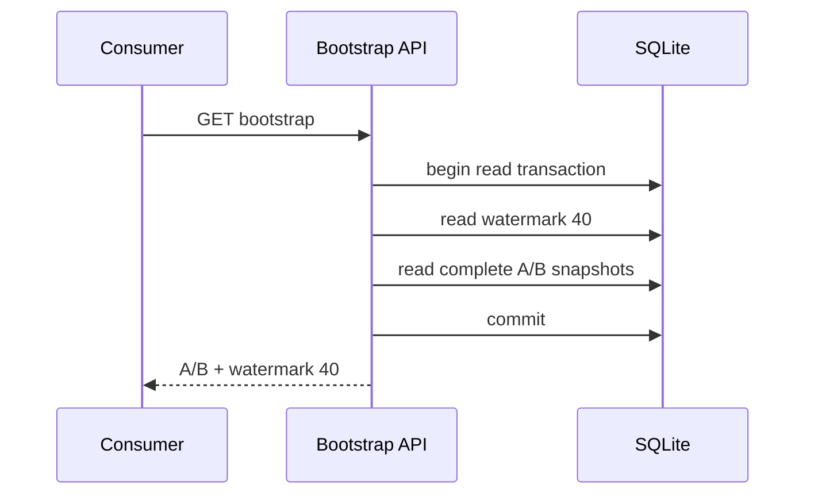

# Workshop 10: Catalog bootstrap and ordered change feeds

Use the [catalog synchronization API reference](catalog-sync-api-reference.md) for request examples, continuation fields, and consumer recovery steps.

A catalog mirror needs two promises. Bootstrap says “replace your local dictionary with this complete picture.” Changes say “apply these committed mutations in sequence order.” Either promise alone is insufficient: a snapshot without continuation becomes stale, while a stream without a starting point cannot recover after lost history.

## Work the example before reading code

Bootstrap returns products A and B with watermark 40. The server then updates A and publishes Upsert 41. It deletes B and publishes Delete 42.

```text
mirror = { A: old-A, B: old-B }
apply 41 => { A: new-A, B: old-B }
apply 42 => { A: new-A }
checkpoint = 42
```

If the consumer crashes after applying 41 but before saving checkpoint 41, it may request after 40 again. Applying the same complete A snapshot twice produces the same mirror. Deleting missing B twice is also harmless. Sequence is the checkpoint; consumers do not need exactly-once network delivery.

## Why bootstrap and watermark share a transaction

Imagine reading A/B, then update A commits as sequence 41, then reading watermark 41. The consumer believes its old A already includes change 41 and will ask after 41, permanently missing the update.

A read transaction gives one consistent database view:



The consumer replaces its mirror, then asks for changes after 40.

## Snapshot version versus product revision versus sequence

These numbers solve different problems.

| Value | Meaning |
|---|---|
| payload version 1 | shape/meaning of serialized fields |
| product catalog revision | number of mirrored changes to this product |
| global sequence | total order across all product changes |
| high watermark | greatest sequence committed with business data |
| retention floor | greatest old sequence intentionally purged |

Old products begin at catalog revision zero. Migration cannot invent events describing edits that happened before the feed existed. Their first tracked mutation becomes revision one.

## What version 1 includes

An Upsert contains the complete product state needed by this mirror: product ID/revision, metadata, active flag, category ID, nullable tax-category ID, created time, variant IDs/SKUs/names/base money/options/weights, and ordered gallery images.

It excludes inventory, reviews, category and tax labels, tags, collections, and quantity-price policies. Their writes therefore do not create version-1 product events. IDs allow a consumer to join separately maintained reference data without pretending those labels are part of this stream.

A Delete contains only product ID and its next revision. It is a tombstone without a product foreign key, so deleting the source graph cannot erase the evidence consumers need.

## One write traced slowly

Every catalog writer owns a local transaction. `CatalogMutationService.StageUpsertAsync` refuses to run without it.

1. Save pending business changes first. This removes deleted gallery children and obtains generated database state.
2. Advance the tracked product catalog revision. The revision is a concurrency token, so an uncoordinated writer cannot silently overwrite the same product.
3. Save the revision.
4. Reload the canonical product graph with no tracking. This prevents a removed image lingering in an EF navigation collection from leaking into the snapshot.
5. Serialize through a 256 KiB bounded stream. Crossing the limit throws before an unbounded byte array is allocated.
6. Insert the immutable change and save to obtain SQLite's AUTOINCREMENT sequence.
7. Advance the singleton high watermark to that sequence and save.
8. The caller commits its transaction. A failure before commit publishes neither business state, event, nor watermark.

Multiple saves do not mean multiple commits. The surrounding database transaction is the atomic boundary.

Delete follows the same boundary: advance revision, add a tombstone, obtain sequence/update watermark, mark the graph deleted, save, commit. The tombstone has no cascading relationship to Product.

## Why AUTOINCREMENT matters

An ordinary integer key may reuse a deleted maximum under some SQLite patterns. Published feed positions must never mean two different events. `INTEGER PRIMARY KEY AUTOINCREMENT` records the greatest allocated value in SQLite's sequence table, so purging changes 1–100 does not let a future event become 1 again.

Gaps are acceptable after rolled-back sequence allocation. Reuse is not. Consumers require increasing order, not consecutive arithmetic.

## Bounded reads

Bootstrap caps IDs at 1,001 as a sentinel. More than 1,000 returns 422. It then loads one complete product graph at a time, measures each through a non-growing bounded stream, and rejects an individual snapshot over 256 KiB. The retained response graph is finally measured as a full wrapper; more than 5 MiB returns 422 before response headers.

Changes accepts limit 1–100. It first reads sequence, product/revision/kind/version, and stored payload-byte metadata. For each candidate it measures the real serialized row metadata and combines that with the stored payload size and the exact response-envelope size. Once it finds the largest prefix that fits, it loads that prefix's payloads in one query and measures the final wrapper under 1 MiB. It never skips an oversized next row to return later rows, because that would break ordered continuation.

Read that flow in three passes: metadata tells us what might fit; one bounded payload query fetches only the chosen rows; the final serialization check proves the complete response fits. This avoids both common mistakes: loading every large payload before applying the byte cap, and using a rough safety allowance that rejects a response which actually fits.

The last delivered sequence may be lower than the current high watermark. The client asks after the last delivered value until it catches up.

## Retention is a prefix operation

Purge examines at most 1,000 oldest metadata rows after the current floor. It deletes only the consecutive rows older than 30 days.

```text
sequence:  80 old | 81 old | 82 recent | 83 old
purge:     80,81
keep:                  82,83
floor:     81
```

It cannot jump over recent 82 to delete old 83. A cursor after 80 is now below the floor and receives 410 with bootstrap instructions. A cursor beyond the high watermark is malformed and receives 400.

Purge selects sequence/time metadata before deletion rather than loading up to 1,000 payloads of 256 KiB each.

## Writer audit

Version 1 hooks product create/update/delete, variant editing, gallery add/reorder/remove, cloning, and import commit. Each stages exactly one Upsert per affected product, except deletion which stages Delete. Import may stage several product events in its one transaction; if one row fails, every imported graph/event rolls back.

Inventory checkout, manual stock correction, reviews, tag/collection membership, option-schema publication, quantity tiers, and taxonomy-label edits do not alter the snapshot fields and emit no event. There is currently no tax-category deletion endpoint; if one is added, its `SET NULL` effect on products must become explicit tracked product Upserts rather than a silent database cascade.

## Read the code in this order

1. `CatalogFeed.cs` for durable event/state meanings.
2. `CatalogFeedConfigurations.cs` for AUTOINCREMENT, no product FK, and singleton state.
3. `CatalogMutationService` for the transactional writer protocol.
4. `CatalogFeedService` for bootstrap, continuation, byte limits, and purge.
5. `CatalogSyncController` for admin-only HTTP behavior and 410 handling.
6. Search `StageUpsertAsync` and `StageDeleteAsync` to audit every writer.
7. Read `CatalogSyncApiTests` and persistence tests as executable consumer examples.

## Exercises

1. Bootstrap watermark is 10. Changes 11–13 exist, but a 1 MiB page fits only 11–12. What cursor is next?
2. Why does Delete need to survive its Product row?
3. A removed image remains in a tracked navigation after `db.Remove`. Why reload after saving?
4. Why is inventory absent from this feed?
5. Purge sees old 20, recent 21, old 22. What is deleted and what is the floor?
6. Explain why four SaveChanges calls inside one transaction can still be atomic.

## Answers

1. Ask after 12; the response also reports the higher committed watermark so the client knows it is not caught up.
2. Without a tombstone, a disconnected consumer can never distinguish deletion from a temporarily absent response.
3. EF object graphs can retain references until reloaded; the database is the canonical post-write graph.
4. Inventory changes frequently and is deliberately outside the administrative product mirror contract.
5. Delete only 20 and set floor 20. The recent row is a retention barrier.
6. SaveChanges sends statements, but the outer transaction withholds durability/visibility until one commit; rollback reverses all statements.

## Journal prompts

- Explain bootstrap/watermark with a photograph and numbered-mail analogy, then name where each analogy fails.
- Write a consumer loop that checkpoints only after applying a whole page.
- List every current product writer and its expected event kind.
- Describe the difference between “at least once delivery” and idempotent application.
- Explain why a gap in sequence values is safe but reuse is dangerous.

This is a bounded product mirror protocol. It is not general database replication, an inventory stream, a permanent event archive, or a substitute for a future large export.
