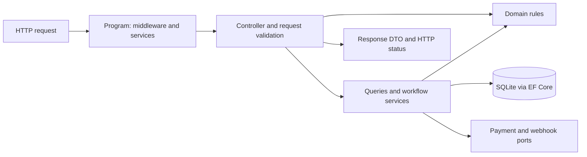

# Trace the code before changing it

**Outcome:** locate a behavior without reading every file. Start with the first-hour exercise.

## A request crosses boundaries

This is a runtime flow, not a project-reference diagram. The compile-time references are `Api -> Infrastructure -> Domain`; tests reference the API. Domain has no package dependency on ASP.NET or EF. The API already uses EF directly for straightforward queries; the catalog composer follows that convention.

| If you need to understand... | Begin here | Ask |
| --- | --- | --- |
| Startup and dependency injection | [Program.cs](../../src/Agora.Api/Program.cs) | What is registered once, and what is created per scope? |
| Input and status codes | [ProductsController.cs](../../src/Agora.Api/Controllers/ProductsController.cs), [DomainExceptionFilter.cs](../../src/Agora.Api/Filters/DomainExceptionFilter.cs) | Where does invalid input become an HTTP response? |
| A business invariant | [InventoryItem.cs](../../src/Agora.Domain/Entities/InventoryItem.cs) | Which public method prevents impossible stock? |
| Mapping objects to storage | [AgoraDbContext.cs](../../src/Agora.Infrastructure/Persistence/AgoraDbContext.cs) | Which constraints does the database enforce independently? |
| A multi-step workflow | [CheckoutService.cs](../../src/Agora.Infrastructure/Services/CheckoutService.cs) | Which steps change memory, SQL, or an external system? |
| A realistic executable example | [CatalogSearchApiTests.cs](../../tests/Agora.Tests/Integration/CatalogSearchApiTests.cs) | What inputs distinguish correct from incorrect behavior? |

## Follow data, not just function names

For `GET /api/products`, query parameters become a `ProductSearchRequest`. The composer builds an `IQueryable<Product>`. `CountAsync` and `ToListAsync` execute database work. `ProductResponse` chooses what is serialized; a database entity is not automatically the public contract.

For checkout, a cart contains references to live products. The order copies names and prices into order items. That snapshot matters: renaming a product tomorrow should not rewrite yesterday's receipt. Find the copying loop in `CheckoutService` and list the fields it preserves.

## Exercise: explain a boundary

Trace `InventoryItem.Reserve(2)` from a checkout call to persistence. Write down the values of on-hand, reserved, and available stock before and after. Calling a method changes an object; `SaveChangesAsync` is what persists tracked changes. Find the concurrency mapping that protects a stale object from overwriting a newer row.

**Hint:** use `rg -n 'Reserve\(|SaveChangesAsync|IsConcurrencyToken' src`. Read the surrounding method, not just the matching line.

**Checkpoint:** explain where you would change a stock invariant, an HTTP validation message, and a SQL filter. If your answer is the same file for all three, trace the boundaries again.
